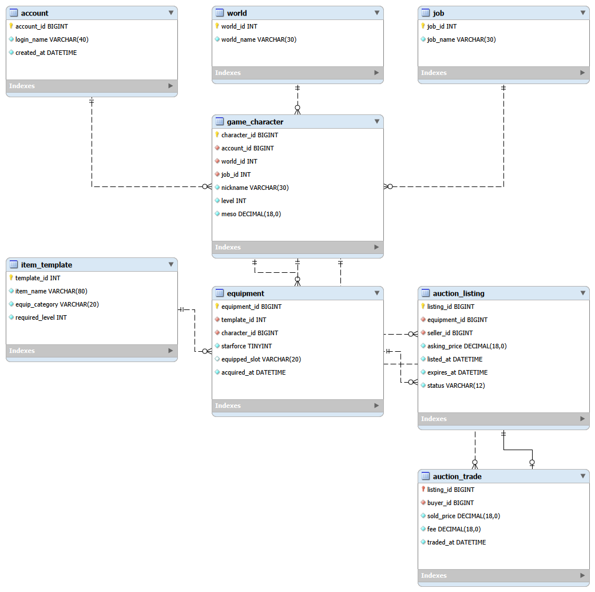
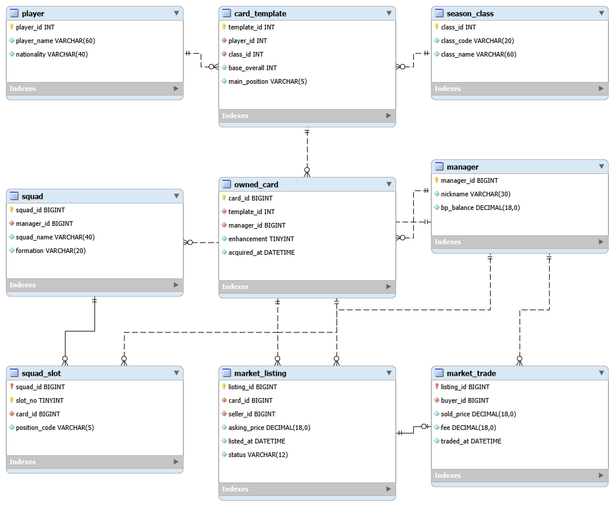
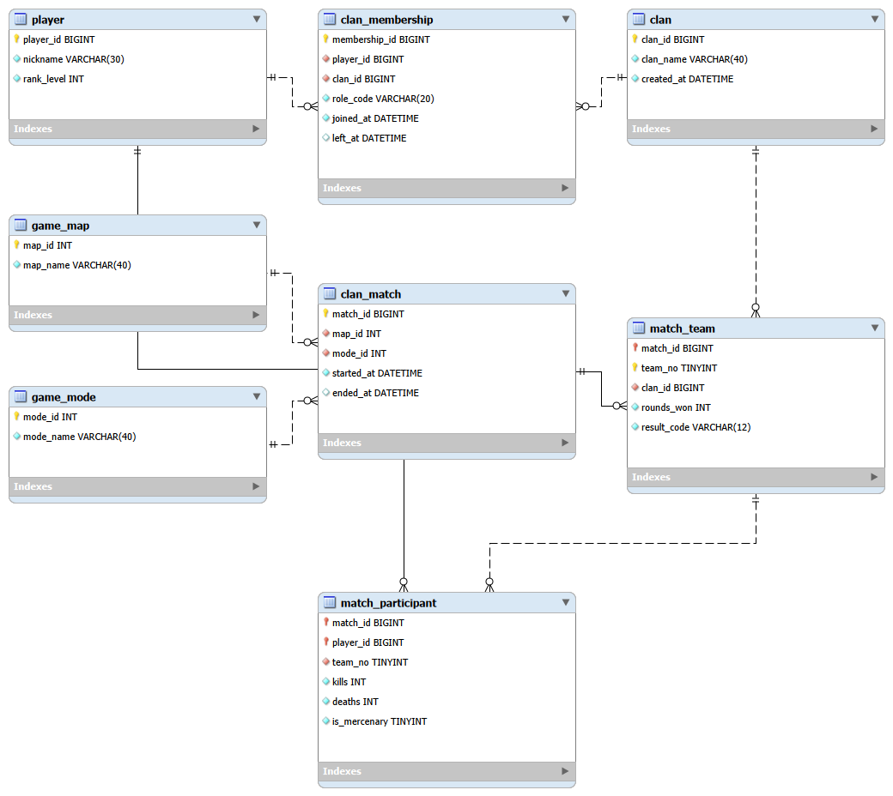

# 넥슨 게임 세 종류의 데이터베이스 분석과 ERD 설계

메이플스토리  FC 온라인  서든어택

이름 박장한    학번 24311010    과목 데이터베이스

### 분석 범위

공개된 게임 기능을 분석하여 데이터를 엔터티와 속성으로 나누고, 기본키와 외래키 및 관계의 수를 정한다. 메이플스토리에서는 개별 장비와 거래 기록, FC 온라인에서는 선수 카드와 스쿼드 배치, 서든어택에서는 클랜 소속과 매치 참가 기록을 중심으로 설계하였다. 기준 정보와 보유 상태 및 과거 기록을 분리하는 것이 세 모델의 공통 원칙이다.

| 게임 | 분석 범위 | 테이블 | FK 관계 |
| --- | --- | --- | --- |
| 메이플스토리 | 캐릭터와 개별 장비 및 옥션 거래 | 8 | 9 |
| FC 온라인 | 선수 카드와 보유 스쿼드 및 이적시장 | 9 | 11 |
| 서든어택 | 클랜 소속 이력과 클랜전 참가 기록 | 8 | 8 |

### 키와 관계 표기

- PK 기본키  FK 외래키  UQ 유일성 제약  NN NULL 금지  AI 자동 증가

- 1 대 N은 한 행에 여러 행이 연결되는 관계이며, N 대 M은 연결 테이블로 표현한다.

- 판매 등록과 거래 완료는 1 대 0..1 관계이다. 등록 하나는 거래가 완료되지 않았거나 한 번 완료된 상태이다.

## 1 메이플스토리

메이플스토리는 캐릭터가 장비를 보유하고 착용하며, 메이플 옥션에서 아이템을 사고파는 RPG이다. 캐릭터별 장비 보유와 장비 한 개 단위의 판매 흐름을 분석한다.

### 데이터 요구사항

- 계정은 여러 캐릭터를 소유하며 각 캐릭터는 하나의 월드와 현재 직업을 가진다.

- 같은 이름의 장비라도 개별 장비의 소유자와 스타포스 수치는 서로 다를 수 있다.

- 판매 등록에는 대상 장비, 판매자, 제시 가격, 등록 및 만료 시각과 상태가 필요하다.

- 거래 완료에는 구매자, 실제 가격, 수수료와 체결 시각을 남겨야 한다.

- 같은 장비는 소유자가 바뀐 뒤 다시 판매될 수 있으므로 과거 등록 기록을 보존한다.

### 설계 가정과 무결성 규칙

- 분석 범위는 장비 한 개 단위 거래와 같은 월드 거래로 제한한다. 소비 및 기타 아이템의 낱개 구매, 월드 간 거래, 잠재능력, 보관함과 수령 대기는 확장 대상으로 둔다.

- 월드 내 닉네임 중복을 금지하는 것은 본 모델의 설계 가정이다. 직업 변경 이력은 저장하지 않는다.

- 같은 캐릭터의 같은 착용 슬롯에는 장비 한 개만 둘 수 있다. 미착용 장비의 슬롯은 NULL로 둔다.

- 한 장비에 OPEN 등록은 하나만 허용한다. 등록 시 판매자와 현재 소유자의 일치, 미착용 상태, 거래 가능 여부를 검사한다.

- 본인이 등록한 장비는 구매할 수 없다. 거래 시 소유권 이전, 착용 해제, 메소 증감, 등록 상태 변경과 거래 기록 생성을 하나의 트랜잭션으로 처리한다.

- 레벨은 양수, 메소와 가격 및 수수료는 음수 금지, 만료 시각은 등록 시각 이후로 검증한다. OPEN 중복과 월드 일치는 애플리케이션에서 검사한다.

### 정규화와 관계 설계

계정, 월드, 직업과 장비 종류를 별도 테이블로 분리하여 같은 설명을 반복 저장하지 않는다. 개별 장비에는 소유자와 강화 상태만 연결한다. 판매자와 구매자는 서로 다른 역할의 캐릭터 FK로 표현한다. 판매 등록과 거래 완료는 1 대 0 또는 1 관계로 분리하여 미판매 등록에 구매자 컬럼이 필요하지 않게 했다. 체결 가격과 수수료는 변경될 수 있는 제시 가격이나 정책 대신 당시의 사실을 저장한다.

### ER 다이어그램

테이블 8개  FK 관계 9개

실선은 식별 관계, 점선은 비식별 관계이다. 막대는 1, 원은 0, 갈라진 선은 여러 개를 뜻한다.

### 엔터티와 컬럼

#### account 게임 계정

| 컬럼 | 데이터형 | 제약 | 의미 |
| --- | --- | --- | --- |
| account_id | BIGINT | PK AI NN | 계정 식별자 |
| login_name | VARCHAR(40) | NN | 로그인 식별명 |
| created_at | DATETIME | NN | 계정 생성 시각 |

UQ (login_name)

#### world 월드

| 컬럼 | 데이터형 | 제약 | 의미 |
| --- | --- | --- | --- |
| world_id | INT | PK AI NN | 월드 식별자 |
| world_name | VARCHAR(30) | NN | 월드 이름 |

UQ (world_name)

#### job 직업

| 컬럼 | 데이터형 | 제약 | 의미 |
| --- | --- | --- | --- |
| job_id | INT | PK AI NN | 직업 식별자 |
| job_name | VARCHAR(30) | NN | 직업 이름 |

UQ (job_name)

#### game_character 캐릭터

| 컬럼 | 데이터형 | 제약 | 의미 |
| --- | --- | --- | --- |
| character_id | BIGINT | PK AI NN | 캐릭터 식별자 |
| account_id | BIGINT | FK NN | 소유 계정 |
| world_id | INT | FK NN | 소속 월드 |
| job_id | INT | FK NN | 현재 직업 |
| nickname | VARCHAR(30) | NN | 캐릭터 이름 |
| level | INT | NN | 캐릭터 레벨 |
| meso | DECIMAL(18,0) | NN | 보유 메소 |

UQ (world_id, nickname)  /  FK (account_id) → account (account_id)  /  FK (world_id) → world (world_id)  /  FK (job_id) → job (job_id)

#### item_template 장비 종류

| 컬럼 | 데이터형 | 제약 | 의미 |
| --- | --- | --- | --- |
| template_id | INT | PK AI NN | 장비 종류 식별자 |
| item_name | VARCHAR(80) | NN | 장비 이름 |
| equip_category | VARCHAR(20) | NN | 무기 방어구 등 분류 |
| required_level | INT | NN | 착용 요구 레벨 |

#### equipment 개별 장비

| 컬럼 | 데이터형 | 제약 | 의미 |
| --- | --- | --- | --- |
| equipment_id | BIGINT | PK AI NN | 개별 장비 식별자 |
| template_id | INT | FK NN | 장비 종류 |
| character_id | BIGINT | FK NN | 현재 소유 캐릭터 |
| starforce | TINYINT | NN | 개별 장비 강화 수치 |
| equipped_slot | VARCHAR(20) | NULL | 착용 슬롯 미착용 시 NULL |
| acquired_at | DATETIME | NN | 현재 소유자의 획득 시각 |

UQ (character_id, equipped_slot)  /  FK (template_id) → item_template (template_id)  /  FK (character_id) → game_character (character_id)

#### auction_listing 옥션 판매 등록

| 컬럼 | 데이터형 | 제약 | 의미 |
| --- | --- | --- | --- |
| listing_id | BIGINT | PK AI NN | 판매 등록 식별자 |
| equipment_id | BIGINT | FK NN | 판매 대상 장비 |
| seller_id | BIGINT | FK NN | 등록 당시 판매자 |
| asking_price | DECIMAL(18,0) | NN | 현재 제시 가격 |
| listed_at | DATETIME | NN | 등록 시각 |
| expires_at | DATETIME | NN | 만료 시각 |
| status | VARCHAR(12) | NN | OPEN SOLD CANCEL EXPIRED |

FK (equipment_id) → equipment (equipment_id)  /  FK (seller_id) → game_character (character_id)

#### auction_trade 옥션 거래 완료

| 컬럼 | 데이터형 | 제약 | 의미 |
| --- | --- | --- | --- |
| listing_id | BIGINT | PK FK NN | 성사된 등록 PK와 FK |
| buyer_id | BIGINT | FK NN | 구매 캐릭터 |
| sold_price | DECIMAL(18,0) | NN | 실제 체결 가격 |
| fee | DECIMAL(18,0) | NN | 실제 적용 수수료 |
| traded_at | DATETIME | NN | 체결 시각 |

FK (listing_id) → auction_listing (listing_id)  /  FK (buyer_id) → game_character (character_id)

## 2 FC 온라인

FC 온라인은 구단주가 선수 카드를 보유하고, 포메이션과 선수 배치를 통해 스쿼드를 구성하는 축구 게임이다. 보유 카드로 구성하는 스쿼드와 이적시장의 카드 판매 거래를 분석한다.

### 데이터 요구사항

- 축구 선수 인물과 클래스별 카드 종류를 구분해야 한다.

- 같은 종류의 카드라도 구단주가 보유한 개별 카드마다 강화 단계가 다를 수 있다.

- 구단주는 여러 스쿼드를 저장하고 스쿼드의 슬롯마다 카드를 배치할 수 있다.

- 같은 카드는 여러 저장 스쿼드에 포함될 수 있으나 한 스쿼드에서 중복 배치할 수 없다.

- 판매 등록과 거래 완료를 구분하고 거래 당시 판매자, 구매자, 가격과 수수료를 보존한다.

### 설계 가정과 무결성 규칙

- 선수 한 명과 클래스 한 개의 조합에 카드 종류 하나를 둔다는 것은 설계 가정이다. 특수 변형 카드는 향후 variant 컬럼으로 확장한다.

- 본 모델의 스쿼드는 자신이 보유한 카드만 사용한다. 웹 스쿼드메이커의 미보유 카드 시뮬레이션과 공유 피드는 제외한다.

- 스쿼드의 구단주와 배치 카드의 현재 소유 구단주는 일치해야 한다. 슬롯 번호 범위와 포지션의 유효성을 애플리케이션에서 검증한다.

- 한 카드의 OPEN 판매 등록은 하나만 허용한다. 판매 전 스쿼드에서 배치를 해제하고 등록자와 소유자의 일치를 검사한다.

- 구매자는 판매자와 달라야 한다. 거래 완료와 BP 증감, 소유권 이전 및 등록 상태 변경은 한 트랜잭션으로 묶는다.

- 구매 주문 대기열, 즉시 구매, 강화 재료 소모, 훈련코치, 경기 기록과 실제 가격 제한 정책은 분석 범위에서 제외한다. 강화는 양수, BP와 가격 및 수수료는 음수 금지로 검증한다.

### 정규화와 관계 설계

player는 인물, card_template은 선수와 클래스의 조합, owned_card는 소유권이 있는 개별 카드를 나타낸다. 선수 이름과 국적은 player에만 저장하여 수정 이상을 줄인다. squad_slot을 통해 스쿼드와 개별 카드의 N 대 M 관계를 두 개의 1 대 N 관계로 분해한다. 복합 PK는 슬롯 중복을, 별도 UNIQUE는 같은 스쿼드의 카드 중복을 막는다. 거래 완료의 가격과 수수료는 과거 사실이므로 현재 제시 가격과 별도로 저장한다.

### ER 다이어그램

테이블 9개  FK 관계 11개

실선은 식별 관계, 점선은 비식별 관계이다. 막대는 1, 원은 0, 갈라진 선은 여러 개를 뜻한다.

### 엔터티와 컬럼

#### manager 구단주

| 컬럼 | 데이터형 | 제약 | 의미 |
| --- | --- | --- | --- |
| manager_id | BIGINT | PK AI NN | 구단주 식별자 |
| nickname | VARCHAR(30) | NN | 구단주 이름 |
| bp_balance | DECIMAL(18,0) | NN | 보유 BP |

UQ (nickname)

#### player 축구 선수

| 컬럼 | 데이터형 | 제약 | 의미 |
| --- | --- | --- | --- |
| player_id | INT | PK AI NN | 선수 인물 식별자 |
| player_name | VARCHAR(60) | NN | 선수 이름 |
| nationality | VARCHAR(40) | NN | 국적 |

#### season_class 선수 클래스

| 컬럼 | 데이터형 | 제약 | 의미 |
| --- | --- | --- | --- |
| class_id | INT | PK AI NN | 클래스 식별자 |
| class_code | VARCHAR(20) | NN | 클래스 코드 |
| class_name | VARCHAR(60) | NN | 클래스 이름 |

UQ (class_code)

#### card_template 선수 카드 종류

| 컬럼 | 데이터형 | 제약 | 의미 |
| --- | --- | --- | --- |
| template_id | INT | PK AI NN | 카드 종류 식별자 |
| player_id | INT | FK NN | 원본 선수 인물 |
| class_id | INT | FK NN | 선수 클래스 |
| base_overall | INT | NN | 기본 종합 능력치 |
| main_position | VARCHAR(5) | NN | 주 포지션 |

UQ (player_id, class_id)  /  FK (player_id) → player (player_id)  /  FK (class_id) → season_class (class_id)

#### owned_card 개별 보유 카드

| 컬럼 | 데이터형 | 제약 | 의미 |
| --- | --- | --- | --- |
| card_id | BIGINT | PK AI NN | 개별 카드 식별자 |
| template_id | INT | FK NN | 카드 종류 |
| manager_id | BIGINT | FK NN | 현재 소유 구단주 |
| enhancement | TINYINT | NN | 개별 강화 단계 |
| acquired_at | DATETIME | NN | 현재 소유자의 획득 시각 |

FK (template_id) → card_template (template_id)  /  FK (manager_id) → manager (manager_id)

#### squad 스쿼드

| 컬럼 | 데이터형 | 제약 | 의미 |
| --- | --- | --- | --- |
| squad_id | BIGINT | PK AI NN | 스쿼드 식별자 |
| manager_id | BIGINT | FK NN | 스쿼드 소유 구단주 |
| squad_name | VARCHAR(40) | NN | 저장한 스쿼드 이름 |
| formation | VARCHAR(20) | NN | 포메이션 |

UQ (manager_id, squad_name)  /  FK (manager_id) → manager (manager_id)

#### squad_slot 스쿼드 선수 배치

| 컬럼 | 데이터형 | 제약 | 의미 |
| --- | --- | --- | --- |
| squad_id | BIGINT | PK FK NN | 스쿼드 PK 일부 |
| slot_no | TINYINT | PK NN | 배치 슬롯 PK 일부 |
| card_id | BIGINT | FK NN | 배치한 개별 카드 |
| position_code | VARCHAR(5) | NN | 배치 포지션 |

UQ (squad_id, card_id)  /  FK (squad_id) → squad (squad_id)  /  FK (card_id) → owned_card (card_id)

#### market_listing 이적시장 판매 등록

| 컬럼 | 데이터형 | 제약 | 의미 |
| --- | --- | --- | --- |
| listing_id | BIGINT | PK AI NN | 판매 등록 식별자 |
| card_id | BIGINT | FK NN | 판매 대상 카드 |
| seller_id | BIGINT | FK NN | 등록 당시 판매자 |
| asking_price | DECIMAL(18,0) | NN | 현재 제시 BP 가격 |
| listed_at | DATETIME | NN | 등록 시각 |
| status | VARCHAR(12) | NN | OPEN SOLD CANCEL |

FK (card_id) → owned_card (card_id)  /  FK (seller_id) → manager (manager_id)

#### market_trade 이적시장 거래 완료

| 컬럼 | 데이터형 | 제약 | 의미 |
| --- | --- | --- | --- |
| listing_id | BIGINT | PK FK NN | 성사된 등록 PK와 FK |
| buyer_id | BIGINT | FK NN | 구매 구단주 |
| sold_price | DECIMAL(18,0) | NN | 실제 체결 BP |
| fee | DECIMAL(18,0) | NN | 실제 적용 수수료 |
| traded_at | DATETIME | NN | 체결 시각 |

FK (listing_id) → market_listing (listing_id)  /  FK (buyer_id) → manager (manager_id)

## 3 서든어택

서든어택은 플레이어가 클랜에 가입하고 팀을 구성하여 대전하는 FPS 게임이다. 용병은 자신의 소속과 관계없이 다른 클랜의 클랜전에 참여할 수 있으므로, 클랜 소속 이력과 매치 참가 팀을 구분하여 분석한다.

### 데이터 요구사항

- 플레이어는 클랜 가입과 탈퇴를 반복할 수 있으므로 가입 기간을 이력으로 남긴다.

- 클랜전 매치는 진행 맵, 모드, 시작 및 종료 시각을 가진다.

- 본 모델의 클랜전에는 두 팀이 참가하며 각 팀은 하나의 대표 클랜을 가진다.

- 플레이어의 참가 기록에는 참가 팀, 킬과 데스 및 용병 여부를 저장한다.

- 현재 클랜이 달라지더라도 과거 매치에서 참가한 팀과 전적이 유지되어야 한다.

### 설계 가정과 무결성 규칙

- 일반 클랜전만 대상으로 하고 루키 클랜, 클랜 버프, 미션, 무기, 채팅과 랭킹 집계는 제외한다. 라운드별 상세 기록은 저장하지 않는다.

- 플레이어의 활동 중 소속 이력은 최대 하나로 가정한다. 가입 기간이 겹치지 않도록 애플리케이션에서 검사하며 직위 변경의 전체 이력은 제외한다.

- match_team의 팀 번호는 1 또는 2이며 같은 매치에 동일 클랜을 두 번 배치하지 않는다. 시작 전에 두 팀이 모두 존재하는지 검사한다.

- 참가 기록은 (match_id, player_id)를 PK로 하여 같은 플레이어의 양 팀 중복 참가를 막는다. (match_id, team_no) 복합 FK는 존재하는 매치 팀에만 참가하도록 보장한다.

- 용병은 대표 클랜의 소속원이 아닐 수 있다. 참가 가능 여부와 용병 표시는 매치 시작 시점의 소속 이력을 참고해 판정하고 과거 참가 기록을 유지한다.

- 킬, 데스 및 승리 라운드는 음수 금지, 종료 시각은 시작 이후로 검증한다. 진행 중 종료 시각은 NULL이며 결과는 PENDING으로 둔다.

### 정규화와 관계 설계

클랜 이름과 맵 및 모드 설명을 각 기준 테이블에만 둔다. clan_membership으로 플레이어와 클랜의 시간에 따른 N 대 M 관계를 표현하고, match_participant로 플레이어와 매치의 N 대 M 관계를 해소한다. match_team은 매치 내 팀을 복합 키로 식별하므로 참가자의 매치와 팀이 서로 어긋나는 참조를 막는다. 현재 소속을 참가 기록에서 추론하지 않아 클랜 이동으로 과거 전적이 바뀌는 수정 이상을 예방한다.

### ER 다이어그램

테이블 8개  FK 관계 8개

실선은 식별 관계, 점선은 비식별 관계이다. 막대는 1, 원은 0, 갈라진 선은 여러 개를 뜻한다.

### 엔터티와 컬럼

#### player 플레이어

| 컬럼 | 데이터형 | 제약 | 의미 |
| --- | --- | --- | --- |
| player_id | BIGINT | PK AI NN | 플레이어 식별자 |
| nickname | VARCHAR(30) | NN | 닉네임 |
| rank_level | INT | NN | 현재 계급 단계 |

UQ (nickname)

#### clan 클랜

| 컬럼 | 데이터형 | 제약 | 의미 |
| --- | --- | --- | --- |
| clan_id | BIGINT | PK AI NN | 클랜 식별자 |
| clan_name | VARCHAR(40) | NN | 클랜 이름 |
| created_at | DATETIME | NN | 클랜 생성 시각 |

UQ (clan_name)

#### clan_membership 클랜 소속 이력

| 컬럼 | 데이터형 | 제약 | 의미 |
| --- | --- | --- | --- |
| membership_id | BIGINT | PK AI NN | 소속 이력 식별자 |
| player_id | BIGINT | FK NN | 가입 플레이어 |
| clan_id | BIGINT | FK NN | 가입 클랜 |
| role_code | VARCHAR(20) | NN | 현재 또는 탈퇴 시 직위 |
| joined_at | DATETIME | NN | 가입 시각 |
| left_at | DATETIME | NULL | 탈퇴 시각 활동 중 NULL |

FK (player_id) → player (player_id)  /  FK (clan_id) → clan (clan_id)

#### game_map 맵

| 컬럼 | 데이터형 | 제약 | 의미 |
| --- | --- | --- | --- |
| map_id | INT | PK AI NN | 맵 식별자 |
| map_name | VARCHAR(40) | NN | 맵 이름 |

UQ (map_name)

#### game_mode 게임 모드

| 컬럼 | 데이터형 | 제약 | 의미 |
| --- | --- | --- | --- |
| mode_id | INT | PK AI NN | 모드 식별자 |
| mode_name | VARCHAR(40) | NN | 모드 이름 |

UQ (mode_name)

#### clan_match 클랜전 매치

| 컬럼 | 데이터형 | 제약 | 의미 |
| --- | --- | --- | --- |
| match_id | BIGINT | PK AI NN | 매치 식별자 |
| map_id | INT | FK NN | 진행 맵 |
| mode_id | INT | FK NN | 진행 모드 |
| started_at | DATETIME | NN | 시작 시각 |
| ended_at | DATETIME | NULL | 종료 시각 진행 중 NULL |

FK (map_id) → game_map (map_id)  /  FK (mode_id) → game_mode (mode_id)

#### match_team 매치 팀

| 컬럼 | 데이터형 | 제약 | 의미 |
| --- | --- | --- | --- |
| match_id | BIGINT | PK FK NN | 매치 PK 일부 |
| team_no | TINYINT | PK NN | 팀 번호 PK 일부 1 또는 2 |
| clan_id | BIGINT | FK NN | 대표 클랜 |
| rounds_won | INT | NN | 승리 라운드 수 |
| result_code | VARCHAR(12) | NN | PENDING WIN LOSE DRAW |

UQ (match_id, clan_id)  /  FK (match_id) → clan_match (match_id)  /  FK (clan_id) → clan (clan_id)

#### match_participant 플레이어 매치 참가

| 컬럼 | 데이터형 | 제약 | 의미 |
| --- | --- | --- | --- |
| match_id | BIGINT | PK FK NN | 참가 매치 PK 일부 |
| player_id | BIGINT | PK FK NN | 참가 플레이어 PK 일부 |
| team_no | TINYINT | FK NN | 참가 팀 번호 |
| kills | INT | NN | 매치 킬 수 |
| deaths | INT | NN | 매치 데스 수 |
| is_mercenary | TINYINT | NN | 용병 여부 0 또는 1 |

FK (match_id, team_no) → match_team (match_id, team_no)  /  FK (player_id) → player (player_id)

## 4 설계 비교와 검토

세 게임의 차이는 데이터가 변하는 이유에 있다. 메이플스토리와 FC 온라인에서는 거래가 소유자를 바꾸며, 서든어택에서는 클랜 이동 이후에도 참가 당시의 팀과 전적을 보존해야 한다. 따라서 현재 상태와 과거에 발생한 사실을 구분하여 저장하였다.

| 비교 항목 | 메이플스토리 | FC 온라인 | 서든어택 |
| --- | --- | --- | --- |
| 주요 사용자 | 캐릭터와 계정 | 구단주 | 플레이어 |
| 기준 데이터 | 월드 직업 장비 종류 | 선수 클래스 카드 종류 | 클랜 맵 게임 모드 |
| 변경되는 상태 | 장비 소유자와 착용 상태 | 카드 소유자와 스쿼드 배치 | 현재 클랜 소속 |
| 과거 기록 | 판매 등록과 완료 거래 | 판매 등록과 완료 거래 | 가입 탈퇴 이력과 매치 참가 |
| 관계의 핵심 | 등록과 거래의 1 대 0..1 | 스쿼드와 카드의 N 대 M | 플레이어와 매치의 N 대 M |
| 주요 복합 키 | 착용 슬롯 UQ | 스쿼드 슬롯 PK | 매치 팀 PK와 참가 PK |

### 무결성

PK와 UQ는 중복을 막고, FK는 존재하는 행만 참조하도록 한다. 같은 물품의 활성 판매 중복, 소유자 일치, 가입 기간 겹침처럼 여러 행을 비교하는 규칙은 트랜잭션과 애플리케이션에서 처리한다. 거래 시에는 등록 및 보유 행을 잠그고, 소유권 이전과 재화 갱신 및 완료 기록 생성을 함께 처리한다. 삭제와 키 변경의 FK 정책은 RESTRICT로 설정하여 참조 중인 데이터가 자동으로 사라지지 않게 한다.

### 정규화 검토

각 컬럼은 하나의 값을 저장하고 반복되는 선수 배치와 참가자는 별도 행으로 표현하여 제1정규형을 따른다. 복합 PK 테이블의 비키 속성은 전체 키에 의존하며, 선수 이름이나 클랜 이름 등 다른 엔터티에 종속되는 값은 해당 엔터티로 분리했다. 제시한 함수 종속과 설계 가정 아래에서 제3정규형을 목표로 하며, 합계와 순위는 기본적으로 조회 또는 집계로 계산한다.

### 참고자료

- [메이플스토리 메이플 옥션 가이드](https://maplestory.nexon.com/guide/n23gameinformation/articles/394)

- [메이플스토리 치장 아이템 가이드](https://maplestory.nexon.com/Guide/N23GameInformation/Articles/422)

- [FC 온라인 스쿼드메이커 개편 안내](https://fconline.nexon.com/news/notice/view?n4ArticleSN=6057)

- [FC 온라인 플레이어스 이적시장 활동 지표](https://shop.fconline.nexon.com/m/PlayUs/Archiving)

- [서든어택 클랜 가이드](https://guide.sa.nexon.com/guide/36)

- [서든어택 클랜전 용병 가이드](https://guide.sa.nexon.com/guide/37)

- [서든어택 클랜홈 가이드](https://guide.sa.nexon.com/guide/87)
