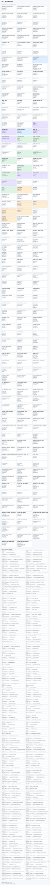
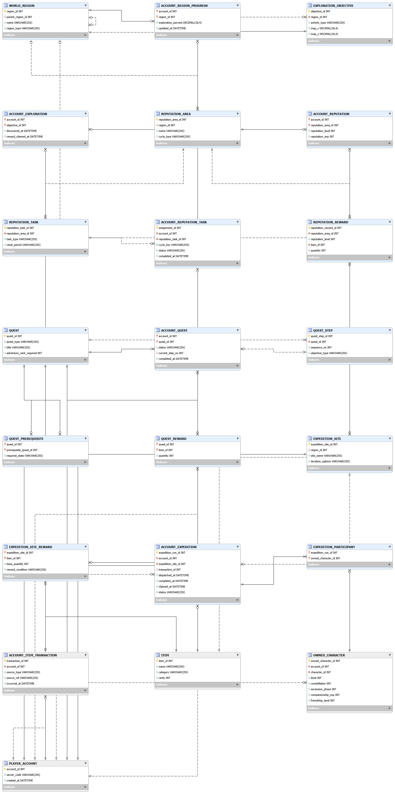
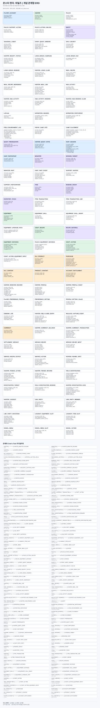
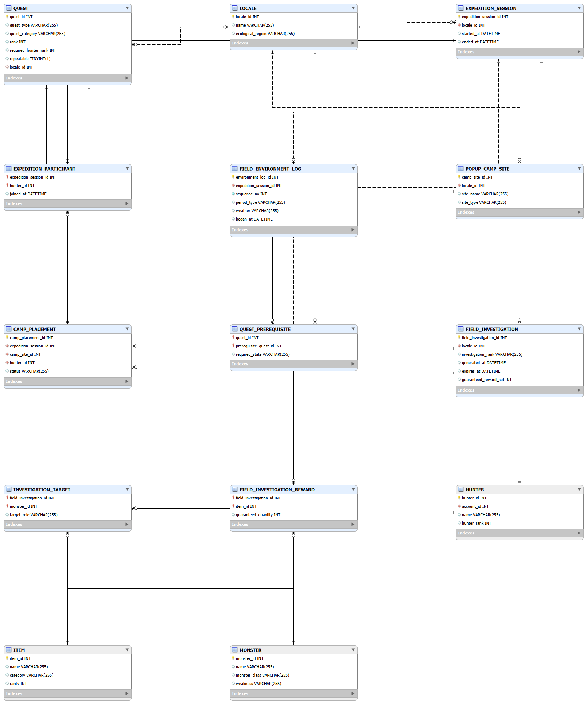

# 게임 데이터베이스 분석 포트폴리오

## 원신 · 몬스터 헌터: 와일즈

> 데이터베이스 프로그래밍 과제 1번 | 학번 24311013 | 이름 ByounGeonHo | 분석 기준일 2026-09-29

## 1. 분석 목적과 범위

이 보고서는 플레이어가 임무를 수행하고 보상을 얻어 보유 데이터와 장비를 성장시키는 흐름을 관계형 데이터 관점에서 분석한다. 분석 대상은 **원신**과 **몬스터 헌터: 와일즈** 두 게임이다. 두 게임 모두 탐험·전투·임무·보상·성장 요소가 있으나, 원신은 캐릭터 수집과 기원 중심의 라이브 서비스 구조가 두드러지고, 와일즈는 몬스터 사냥과 재료를 사용한 장비 제작이 반복 플레이의 중심이다. 게임별 기능, 데이터 구조, ERD 및 두 게임의 차이를 분석한다 [1].

분석 범위는 공개 자료로 확인되는 플레이어 대상 기능과 계정·진행·퀘스트·전투·수집·성장·경제·소셜·기간 콘텐츠의 영속 데이터다. 기능 설명은 출처를 근거로 하며, 엔터티·속성·키·관계는 해당 기능을 관계형 데이터베이스로 표현한 설계안이다. 실제 게임의 비공개 서버 스키마는 분석 대상에 포함하지 않는다.

### 공통 플레이 루프

`플레이어 → 퀘스트/사냥 → 보상·재료 → 인벤토리 → 캐릭터/장비 성장 → 다음 퀘스트/사냥`

ERD는 이 공통 흐름을 중심에 두고, 원신에는 기원·유료 재화·구매 기록을, 와일즈에는 상품·DLC 콘텐츠 권한을 별도 영역으로 붙였다. 지도 타일, 대화 스크립트, 전투 프레임 데이터, 서버 매칭 구현 등은 범위에서 제외했다.

## 2. 원신 분석

### 2.2 주요 시스템 및 데이터 흐름

원신 ERD의 `PlayerAccount`는 HoYoverse 로그인 계정이 아니라, 특정 서버에 귀속된 게임 진행 프로필(UID)을 뜻한다. 진행·캐릭터·구매 자료는 서버 간 이동하거나 병합되지 않는다 [62]. 로그인 자격 증명 자체는 모델 범위에서 제외한다.

1. 계정은 서버 구분을 포함한 진행 데이터를 갖고, 여러 퀘스트의 진행 상태를 기록한다.
2. 계정은 캐릭터 원형을 바탕으로 여러 보유 캐릭터 인스턴스를 갖는다. 파티와 파티 슬롯은 보유 캐릭터를 구성한다.
3. 캐릭터 인스턴스는 성장 가능한 무기·성유물 인스턴스를 장착한다. 재료와 재화는 계정 인벤토리에 수량 단위로 보관한다.
4. 퀘스트 보상 정의는 보상 아이템 및 수량과 연결되고, 플레이어의 완료 상태는 계정-퀘스트 연결 행에 기록된다.
5. 기원 배너는 기원 기록과 연결된다. 기원 기록은 계정, 배너, 소모한 프리미엄 재화, 획득 자산, 시각을 남긴다. 상품 구매는 결제 상품과 연결하고, 지급된 재화는 원장에 기록한다.

공식 업데이트 안내는 퀘스트 보상, 캐릭터·무기 기원, 무기·성유물 강화 기능이 게임 시스템에 존재함을 보여준다 [2]. 공식 기원 안내는 배너 유형마다 기원 횟수/천장 집계가 분리되거나 공유되는 규칙이 있음을 명시한다 [3]. 따라서 천장 규칙 자체를 모든 배너에 공통 상수로 고정하지 않고, 배너의 `pity_group` 설정과 계정별 기원 이력으로 표현했다.

### 2.3 핵심 엔터티와 키

| 엔터티 | 주요 속성(예시) | 키 및 역할 |
|---|---|---|
| `PlayerAccount` | `account_id`, `server_code`, `created_at` | PK `account_id`; 계정 기준 데이터의 소유자 |
| `AccountProgress` | `account_id`, `adventure_rank`, `world_level`, `updated_at` | PK/FK `account_id`; 계정별 현재 진행 요약 |
| `WorldRegion` / `AccountRegionProgress` | 지역 계층; 계정·지역별 해금 상태와 탐험 진행률 | 지역 정의와 복합 PK `(account_id, region_id)` 진행 요약 |
| `ExplorationObjective` / `AccountExploration` | 지역별 활동 목표; 발견·수령 시각 | 지역 목표 정의와 계정별 발견 상태 연결 |
| `ReputationArea` / `AccountReputation` | 평판 적용 지역·월드 지역 참조; 계정별 레벨·경험치 | 복합 PK `(account_id, reputation_area_id)` |
| `ReputationTask` / `AccountReputationTask` | 의뢰/현상 토벌 정의; 주기별 계정 과제 상태 | 반복 주기 키를 포함한 실제 과제 할당 이력 |
| `ReputationReward` | 평판 지역·레벨·아이템·수량 | 보상 정의; 아이템 정의에 FK |
| `Quest` | `quest_id`, `title`, `quest_type`, `adventure_rank_required` | PK `quest_id`; 퀘스트 정의 |
| `QuestStep` | `quest_step_id`, `quest_id`, `sequence_no`, `objective_type` | PK `quest_step_id`; 퀘스트의 순서 있는 목표 |
| `QuestPrerequisite` | `quest_id`, `prerequisite_quest_id`, `required_state` | 두 퀘스트 정의를 잇는 자기참조 복합키 |
| `AccountQuest` | `account_id`, `quest_id`, `status`, `current_step_no`, `completed_at` | 복합 PK `(account_id, quest_id)`; 계정별 진행 상태 |
| `CharacterAsset` | `character_id`, `name`, `element`, `rarity`, `weapon_type` | PK `character_id`; 캐릭터 도감 정의 |
| `OwnedCharacter` | `owned_character_id`, `account_id`, `character_id`, `level`, `constellation` | PK `owned_character_id`; 계정별 캐릭터 보유 상태. `(account_id, character_id)`는 UNIQUE |
| `Party` / `PartyMember` | 파티 이름; 슬롯 번호와 보유 캐릭터 ID | PK `party_id`; 멤버는 복합 PK `(party_id, slot_no)` |
| `EquipmentAsset` / `OwnedEquipment` | 장비 이름·종류·희귀도; 강화 레벨·주옵션 | 도감 정의와 보유 장비 인스턴스를 분리 |
| `QuestReward` | `quest_id`, `item_id`, `quantity` | 복합 PK `(quest_id, item_id)`; 보상 정의 |
| `InventoryStack` | `account_id`, `item_id`, `quantity` | 복합 PK `(account_id, item_id)`; 계정별 아이템 수량 |
| `WishBanner` / `WishPull` / `AccountWeaponPathState` | 배너 기간·종류; 기원 결과; 계정·무기 배너별 선택 목표와 Fate Point | 기원 이력과 무기 배너 보장 상태를 분리 |
| `Currency` / `CurrencyLedger` | 재화 이름; 변동량·원천·시각 | 획득/소비 이벤트를 추적하는 원장 |
| `StoreProduct` / `Purchase` | 플랫폼·상품 종류·가격; 주문 참조·결제 시각 | 상품 정의와 계정 구매 이벤트 |

`WishPull.asset_id`는 캐릭터/무기 도감의 공통 상위 자산을 참조한다. 실제 SQL 구현에서는 `Asset` 상위 테이블과 캐릭터·장비 하위 테이블을 두어 외래키 무결성을 유지한다. 계정 소유 캐릭터와 장비 인스턴스는 도감 정의와 분리하므로, 같은 자산을 여러 계정이 소유해도 성장 상태가 섞이지 않는다.

### 2.4 계정·진행·퀘스트

#### 원신

공식 업데이트 기록은 Archon/Story/World 퀘스트와 선행 퀘스트·모험 등급 조건, 지역 평판 해금 조건을 각각 사례로 보여준다 [2]. 퀘스트의 연쇄 진행과 해금 조건을 표현하기 위해 정의·선행 조건·단계·계정별 상태를 분리한다.

- `PlayerAccount`는 서버가 구분된 플레이 계정 식별자다. 인증 정보는 분석 범위 밖이다.
- `AccountProgress`는 계정 단위 모험 등급·월드 레벨의 현재 요약값을 저장하는 1:1 확장이다. 이를 캐릭터별 레벨과 분리한다.
- `Quest`는 퀘스트 종류, 제목, 요구 모험 등급 등 정의 데이터를 갖는다. `QuestStep`은 목표/순서의 반복 목록이다.
- `QuestPrerequisite`는 선행 퀘스트와 대상 퀘스트 사이의 자기참조 다대다 관계를 해소한다. 복수 선행 조건 및 상태 조건을 표현한다.
- `AccountQuest`는 계정별 진행 상태, 현재 단계, 시작/완료 시각을 보존한다. 완료 결과는 진행 상태의 한 행이며, 계정과 퀘스트의 복합키로 중복 진행 행을 막는다. 현재 단계는 `(quest_id, sequence_no)`에 대한 선택적 복합 외래키로 검증하고, 해당 단계 조합은 고유하게 둔다.

지역별 탐험률·도시 평판의 점수와 보상 단계는 2.6절에서 다룬다. 정확한 내부 업데이트 이벤트나 조건 문법은 공개 자료만으로 확정할 수 없으므로, 이 모델에서는 키로 추적 가능한 명시적 선행 퀘스트만 다룬다.

#### 몬스터 헌터: 와일즈

공식 업데이트 안내는 헌터 랭크와 Main Mission 선행 조건, 반복 가능한 Event Quest를 설명한다 [7]. Arena·Challenge Quest의 사전 장비·인원·보상 구조는 Title Update 1 안내에 소개되어 있다 [5]. 공식 게임 소개 자료는 필드의 몬스터를 목표로 지정해 퀘스트를 시작하는 흐름과 Expedition/캠프 기능을 설명한다 [8].

- `PlayerAccount`는 플랫폼 계정 개념, `Hunter`는 게임 안의 플레이어 캐릭터 및 헌터 랭크를 뜻한다. 외부 플랫폼 계정 체계의 세부사항은 가정하지 않는다.
- `Quest`는 종류/범주, 퀘스트 등급, 최소 헌터 랭크, 반복 가능 여부를 담는다. Main Mission, Optional/Extra Mission, Event, Arena/Challenge와 환경 목표 기반의 퀘스트가 같은 퀘스트 정의 틀을 쓰되, 범주별 조건은 구별한다.
- `QuestPrerequisite`는 선행 Main Mission 등 퀘스트 간 요건을 자기참조 연결로 표현한다. 숫자형 랭크 조건은 `Quest.required_hunter_rank`에 둔다.
- `HunterQuestState`는 헌터별 해금 및 최초 완료 상태를 저장한다. `HuntSession`은 실제 반복 수행 건을 저장하므로, 최초 완료 여부와 반복 출격 이력을 섞지 않는다.

랭크만으로 해금 여부를 계산하면 스토리 진행 조건이나 이벤트 종료/시작 같은 조건을 놓친다. 따라서 순위 조건과 퀘스트 선행 조건을 분리하고, 이벤트 기간·환경 조건은 각 콘텐츠의 조건 데이터로 구분한다.

### 2.5 Crow’s Foot ERD

퀘스트·탐험 영역의 Crow’s Foot ERD는 다음과 같다.

편집 가능한 Mermaid 원본: [`erd_genshin.mmd`](./erd_genshin.mmd)

주요 카디널리티는 계정 1:N 보유 캐릭터·퀘스트 상태·지역 진행·탐험 기록·평판·인벤토리·기원 기록·구매 기록, 퀘스트 1:N 단계·계정별 상태·보상 정의, 지역 1:N 탐험 목표, 캐릭터 1:N 보유 인스턴스, 파티 1:N 슬롯이다. 파티 멤버는 보유 캐릭터를 최대 한 번만 배치하도록 유일 제약을 둔다. 장착 연결은 보유 캐릭터와 보유 장비 사이의 선택 관계다. 상품 구매와 재화 원장은 결제/지급 이벤트를 분리해 감사 추적을 가능하게 한다.

### 2.6 세계·탐험·지역 평판

공식 시스템 안내는 지역별 탐험 진행률에 상자 발견, 오큘러스 수집, 웨이포인트 해제 등이 반영된다고 설명하고, 도시 평판을 별도 지역별 진행과제로 제공한다 [2]. 이를 계정 전체 하나의 퍼센트나 범용 퀘스트로 합치지 않았다.

- `WorldRegion`은 지역/하위 지역의 정의 트리다. `AccountRegionProgress`는 계정-지역마다 해금 상태와 표시 진행률을 요약한다. 진행률 산정 공식은 공개 자료로 충분히 확인되지 않아 상세 가중치 식은 모델에 넣지 않았다.
- `ExplorationObjective`는 지역별로 발견 가능한 탐험 목표의 정의를 담고, `AccountExploration`은 계정별 발견/보상 수령 시각을 기록한다. 하나의 목표는 계정마다 한 번만 발견될 수 있도록 복합 PK를 둔다.
- `ReputationArea`는 평판이 계산되는 도시/지역 단위고 가능한 경우 `WorldRegion`과 연결한다. `AccountReputation`은 계정별 평판 레벨·경험치다. 보상은 `ReputationReward`에서 지역·레벨·아이템 단위로 정의한다.
- `ReputationTask`는 현상 토벌·주민 의뢰 등 제공 과제의 정의고, `AccountReputationTask`는 주기별 실제 계정 할당/완료/수령 이력이다. 같은 과제가 다른 주기에 다시 나올 수 있어 `cycle_key`를 둔다.

진행률은 `AccountExploration`에서 계산 가능한 요약으로 볼 수 있지만, 게임이 노출하는 백분율 및 평판 점수는 현재값 스냅샷으로 유지할 수 있도록 했다. 요약값이 발견 이력과 모순되지 않게 하는 갱신 경계는 구현 시 트랜잭션으로 보장해야 한다.

### 2.7 전투 도전·적·결과 기록

공식 도전 안내는 원신에 주기별 전투 콘텐츠, 단계별 규칙, 사용 가능한 캐릭터 조건, 도전 완료와 별 보상 수령이 있음을 보여준다. 캐릭터 시연 도전은 고정 편성으로 플레이하고 완료 보상을 받을 수 있다 [2], [9]. 모든 일반 필드 전투의 피해량·원소 반응을 서버 로그로 저장한다고 가정하지 않고, 플레이어가 재조회하는 도전 실행과 단계 결과를 영속 데이터 범위로 잡았다.

- `CombatChallenge`는 나선 비경, 환상극, 캐릭터 시연과 기간 이벤트 도전의 정의/시즌을 표현한다. 현재 주기·도전 정의를 바꾸어도 과거 계정 실행은 `AccountChallengeRun`으로 보존한다.
- `ChallengeStage`는 도전 내 순서가 있는 전투 단계며, `StageEnemy`는 단계·웨이브에 등장하는 적 정의와 수량을 연결한다. `EnemyAsset`은 적 도감 성격의 정의로서 계정 보유 자산과 혼동하지 않는다.
- `AccountChallengeRun`은 계정이 도전에 진입한 실행 건이다. `ChallengeStageResult`는 실행 중 각 단계를 성공/실패와 점수·별 수로 기록한다. `ChallengeRewardClaim`은 조건 충족과 실제 수령을 구분해 아이템 및 수량·수령 시각을 보존한다.
- 관계 카디널리티: 도전 1:N 단계, 단계 M:N 적(웨이브·수량을 가진 `StageEnemy`로 해소), 계정 1:N 실행, 실행 1:N 단계 결과, 단계 결과 1:N 수령 보상이다. 보상 수령은 여러 아이템 행으로 나뉜다.

점수·별 등급과 파티 편성의 상세 규칙은 도전 종류 및 주기별로 변하므로 고정 컬럼을 무리하게 늘리지 않았다. 단계 결과에서 필요한 일부 지표만 예시로 두고, 버전이 다른 도전 정의는 별도 `challenge_id`로 관리하는 모델이다.

### 2.8 원신 파티·협동 세션

원신은 계정이 저장하는 파티 구성을 이미 `Party`·`PartyMember`로 모델링했다. 다만 저장된 편성은 특정 순간의 다른 플레이어와 함께한 월드 세션과 다르다. 공식 공지에서 협동 모드와 이용 중 신고 기능이 확인된다 [2]. 따라서 `CoopSession`은 호스트와 세션 시간, `CoopParticipant`는 세션별 참가 계정·역할·접속 시간 및 선택 캐릭터를 표현한다. 파티 편성은 사전 구성이고, 세션 참여 캐릭터는 실제 협동 실행 기록이다.

카디널리티는 계정 1:N 호스트 세션, 세션 M:N 계정(참가 엔터티로 분해), 세션 참가자 0..1 선택 보유 캐릭터다. 같은 계정의 재접속을 이력으로 남겨야 하면 참여 구간별 PK로 변경할 수 있으나, 현재 모델은 세션별 한 행으로 단순화했다.

### 2.9 아이템·보상·인벤토리

공식 시스템 안내는 원신 인벤토리를 무기·성유물·기타 아이템 유형별 공간으로 관리하고, 재료를 중첩해 수량으로 보유하는 사례를 설명한다. 퀘스트 완료 보상과 이벤트 상점 교환은 보상 획득의 서로 다른 흐름이다 [2].

- `Item`은 재료·소비품·화폐성 아이템 등 수량형 보유 대상의 정의다. `InventoryStack`은 현재 계정별 보유량 요약이다. 장비 자산의 개별 강화·장착 정보는 기존 `OwnedEquipment`로 따로 저장한다.
- `AccountItemTransaction`은 보상, 교환, 강화 재료 소비, 폐기 등 아이템 잔액 변경의 원천과 시각을 남긴다. `AccountItemLine`은 한 거래에서 item별 증감량을 기록하며 양수는 지급, 음수는 소비를 뜻한다.
- `QuestReward`, `ReputationReward`, `ChallengeRewardClaim`은 각각 고정 보상 정의 또는 실제 도전 수령 기록을 보존한다. `AccountItemTransaction`은 최종 수량 변화를 추적하고, 보상/교환 원천은 출처 유형 및 참조값으로 연결한다.

이는 아이템 수량과 획득·소비 이력을 함께 재구성하기 위한 제안이다. `InventoryStack`을 거래 행에서 계산하는 파생 뷰로 둘 수 있고, 성능을 위해 스냅샷으로 저장할 때는 해당 거래와 잔액을 같은 트랜잭션에서 갱신해야 한다. 장비 강화의 모든 세부 소모 규칙과 패키지별 인벤토리 한도는 버전별 규칙이라 모델에 고정하지 않았다.

### 2.10 캐릭터 소유·성장·특성

원신의 캐릭터 도감과 캐릭터 돌파/특성 육성 재료는 캐릭터 정의와 계정이 보유한 성장 상태가 별도 데이터임을 보여준다 [2]. 이 모델에서 `PlayerAccount`는 로그인 자격 증명이 아니라 특정 서버에 귀속된 게임 진행 프로필(UID)을 뜻한다. 서버별 진행·캐릭터·구매 데이터는 서로 병합되지 않는다 [62]. 기존 `CharacterAsset`은 캐릭터의 기본 정의, `OwnedCharacter`는 그 프로필의 캐릭터별 보유 상태다.

- `OwnedCharacter`의 레벨·돌파 단계·별자리 수는 소유 상태다. 같은 캐릭터를 다시 획득하면 새 캐릭터가 추가되는 것이 아니라 Stella Fortuna와 별도 보상으로 변환되므로, `(account_id, character_id)`를 UNIQUE로 제한한다 [61]. 중복 획득 보상 수량은 성급·획득 횟수에 따라 달라지므로 여기서는 별자리 현재 상태만 저장한다.
- `CharacterTalent`는 캐릭터 종류별 특성 슬롯 정의, `OwnedCharacterTalent`는 특정 보유 캐릭터에서 해당 특성의 레벨을 저장한다. 정의와 상태를 분리해 캐릭터마다 존재하지 않는 특성을 잘못 배정하지 않도록 복합 참조를 둔다.
- 돌파·레벨·특성 강화 재료의 수량 증감은 2.9절의 `AccountItemTransaction`을 통해 추적한다. 세부 요구량 표는 밸런스 변경을 고려해 개념 모델의 고정 범위에서 제외한다.

관계는 캐릭터 정의 1:N 보유 인스턴스, 캐릭터 정의 1:N 특성 정의, 보유 인스턴스 M:N 특성 정의(성장 상태 연결 엔터티로 분해)다. 한 보유 캐릭터의 특성 정의는 해당 캐릭터 도감에 속해야 한다.

### 2.11 무기·성유물·장착 빌드

원신 장비는 무기와 성유물을 계정이 보유하고, 캐릭터 슬롯에 장착하며, 강화·정련 또는 잠금할 수 있다 [2]. 이미 `EquipmentAsset`, `OwnedEquipment`, `CharacterEquipment`가 정의·보유 인스턴스·장착 연결을 구분한다.

- `OwnedEquipment`에 무기 정련 단계와 잠금 여부를 추가하고, `OwnedEquipmentSubstat`으로 성유물 인스턴스의 부옵션 종류/값을 개별 저장한다. 장착 관계는 캐릭터-슬롯당 최대 한 장비, 보유 장비는 한 시점에 하나의 슬롯만 점유하도록 고유 제약을 둔다.
- `EquipmentSet`과 `EquipmentSetMember`는 성유물 세트 및 구성 부위를 정의하고, `EquipmentSetBonus`는 필요 부위 수별 효과 설명을 둔다. 이 데이터는 패치에 따라 효과 정의가 바뀔 수 있어 실제 내부 효과 수식을 복제하지 않는다.
- `AccountItemTransaction`에서 강화/정련 재료 증감을 기록할 수 있다. 경험치량·초과분 반환 등은 공식 업데이트에서도 조정된 바 있어 정책 수치를 ERD 상수로 박지 않는다 [2].

세트 정의 M:N 성유물 도감은 `EquipmentSetMember`가 해소하고, 세트 하나는 복수의 효과 문턱을 가진다. 보유 장비 하나는 여러 부옵션 행을 가질 수 있다. 저장 파티는 `Party`/`PartyMember`에 포함하며, 게임이 명시적으로 제공하는 프리셋 범위는 2.20절에서 구분했다.

### 2.12 재화·기원·유료 상품

원신 공식 기원 안내는 이벤트 기원 쌍 사이의 천장 횟수 공유와 다른 기원 종류와의 분리를 설명하고, 무기 기원은 Epitomized Path 선택을 제공한다 [3], [9]. 공식 Top-Up Center 공지는 Genesis Crystal, Welkin Moon, Battle Pass 상품 종류를 명시한다 [15]. 획득 확률형 기원과 직접 구매형 기간/진척 상품은 서로 다른 데이터 흐름이다.

- `CurrencyLedger`는 계정 재화의 증감량과 출처를 기록한다. `StoreProduct`와 `ProductGrant`는 플랫폼·상품 유형·지급 구성 및 즉시/주기 일정을 정의한다. 외부 구매 확인 후 게임 내 재화 지급은 별도 원장 거래로 남긴다.
- `Purchase`는 플랫폼 주문 참조·실결제 금액·통화 코드·시각을 기록하고 카드/인증 정보를 저장하지 않는다. 시간제 상품은 `AccountProductEntitlement`에서 시작/만료 상태를 관리하고, 주기 지급은 `ProductGrant`와 `CurrencyLedger` 이력에 반영한다.
- `WishGroup`은 기원 종류별 보장 카운터 그룹, `WishBanner`는 기간별 배너, `WishBannerAsset`은 배너 풀/픽업 자산이다. `WishPull`은 실제 시도와 결과·사용 재화를 남긴다. `AccountWishState`는 이력에서 재구성할 수 있는 현재 상태 스냅샷이며, 같은 보장 그룹을 공유하는 배너는 한 상태를 함께 사용한다.
- `WishTargetSelection`은 무기/연대기 등 선택 대상과 선택 시각을 남긴다. `AccountWeaponPathState`는 계정·무기 배너별 선택 대상과 Fate Point 상태를 분리해 추적한다. 실제 최대치·배너 종료 시 초기화 등은 배너 정책으로 두며 모든 기원 종류를 전역 카운터 하나로 합치지 않는다. 보장 그룹의 경계는 공식 배너 공지에 맞춰 데이터로 둔다.

관계는 계정 1:N 구매·기원 시도·기간 상품 권한·재화 원장, 기원 그룹 1:N 배너/계정 카운터, 무기 배너별 계정 Fate Point 상태, 배너 M:N 획득 가능 자산, 상품 1:N 지급 규칙이다. 기원 결과 이력은 직접 구매 상품 이력과 별도다.

### 2.13 기간 이벤트·주기 콘텐츠·업적

공식 버전 이벤트 미리보기는 시작/종료 시간이 있는 기간 이벤트와 단계별 이벤트 활동을 제공하고, 업적 시스템 공지는 업적 계열 추가를 안내한다 [2], [17]. 이를 상설 도전 결과(`AccountChallengeRun`)와 다른 주기·진행 데이터로 관리한다.

- `LiveEvent`는 기간/이벤트 유형, `EventActivity`는 그 안의 도전·임무 및 초기화 주기를 정의한다. `AccountEventProgress`는 계정·활동·회차(`cycle_key`)별 상태/점수를 유지하므로 반복 초기화 뒤에도 과거 회차를 식별할 수 있다.
- `EventActivityReward`는 회차별 활동 보상표, `AccountEventRewardClaim`은 실제 수령을 기록한다. 완료 가능과 보상 수령 가능/완료를 분리한다.
- `Achievement`는 도감형 업적 조건, `AccountAchievement`는 계정별 진행/해금/수령 시각을 둔다. 일부 조건의 증가치는 다른 게임 이벤트에서 집계될 수 있으나 모델에서는 공개되는 진행 요약만 담는다.

도전 별 보상과 기간 이벤트 보상은 중복될 수 있는 별개의 수령 정책이다. activity/event, 계정, 회차, 보상 번호가 중복 수령을 막는 키 조합이고, 기간 종료 뒤에도 결과/수령 이력을 삭제하지 않는다. 인게임 밖 웹 이벤트는 `event_type`으로 구분할 수 있으며 캐릭터 UID에 지급되는 구조와 플랫폼 계정 체계는 실제 배포 경로를 확인해 연결한다.

### 2.14 선계 하우징·요리

공식 버전 1.5 안내는 선계 안에 가구를 배치해 환경을 꾸미고, 가구 배치로 신뢰 등급과 선계 선력을 높이며, 재료로 가구를 제작하고 선계 화폐를 교환하는 기능을 설명한다. 선계 업데이트에는 가구 인벤토리 분류와 관련 제작/교환 과제도 포함됐다 [20]. 원신의 하우징은 캐릭터 외형 보유가 아니라 계정의 공간 배치·생산/교환 상태를 만든다.

- `RealmStyle`은 해금 가능한 선계 테마, `RealmLayout`은 계정이 편집한 레이아웃, `FurnishingAsset`은 배치 가능한 가구 카탈로그다. `OwnedFurnishing`은 계정 보유량, `FurnishingPlacement`는 레이아웃 내 구역과 좌표/회전 배치 상태다.
- `FurnishingRecipe`와 `FurnishingRecipeMaterial`은 가구 제작 정의와 재료, `AccountItemTransaction`은 제작 재료 차감과 결과 가구 지급을 추적한다. 배치 가구는 보유량에서 차감/점유되는 수량 일관성을 지켜야 한다.
- `AccountRealmProgress`는 신뢰 등급·경험, 선계 선력·화폐를 현재 상태로 요약한다. `RealmCompanion`은 계정 소유 캐릭터를 레이아웃에 초대하는 관계를 기록한다.
- 요리는 별도 `FoodRecipe`/`FoodRecipeMaterial`에서 레시피·산출 아이템·재료 수량을 정의한다. `AccountRecipeState`는 해금 레시피, `CookAction`은 계정 조리 실행·품질 결과를 기록하고 원장과 실제 소비를 연결한다.

한 계정은 여러 선계 레이아웃을 보유하고, 각 레이아웃은 가구/동료 배치를 포함한다. 신뢰 등급과 선계 화폐의 적립 공식 및 실제 가구 하중/배치 한도는 고정 정책으로 추정하지 않는다.

### 2.15 도감·열람 상태·설정·문의

공식 버전 1.1 공지는 장비·재료·지리·책·튜토리얼 도감과 캐릭터 도감을 구분해 소개한다 [2]. 정의 자체는 기존 게임 카탈로그 엔터티와 겹치므로, 여기서는 `ArchiveEntry`가 도감 분류/표시 항목을 연결하고 `AccountArchiveState`가 계정별 발견·열람 상태를 저장하는 개념 구조를 제안한다. 항목별 대상 형식과 ID는 유형별 카탈로그를 연결하는 설계상 참조다.

같은 공지에는 키보드/컨트롤러 입력 재배치, 그래픽·카메라 옵션, 협동 신고 기능이 나열된다 [2]. `PlayerPreferenceProfile`은 계정/플랫폼/기기 범위의 설정 묶음, `PreferenceSetting`과 `ProfileSettingValue`는 설정 정의와 값을 표현한다. 설정 저장 위치는 서버·클라이언트·플랫폼 간 다를 수 있어 이 모델은 저장 주체를 `device_scope`로 표시하고 동기화 동작은 가정하지 않는다. `CoopReportSubmission`은 신고 시각·유형·협동 세션 참조만 제안하며 신고 내용·처리 데이터는 공개 근거가 없어 저장 속성에 넣지 않는다.

카디널리티는 계정 1:N 도감 상태/설정 프로필/신고, 도감 항목 1:N 계정 상태, 프로필 M:N 설정 정의다. 신고는 선택적으로 식별 가능한 세션을 참조할 수 있다.

### 2.16 플랫폼 경계·저장 설정

위 설정 모델의 핵심은 진행·인벤토리와 사용자 환경설정을 구분하는 것이다. 그래픽/입력 설정은 기기나 플랫폼 범위로 보관될 수 있으므로 게임 계정 진행 레코드와 같은 저장소에 있다고 단정하지 않는다. 실제 설정 항목 및 값은 플랫폼/버전마다 다를 수 있어 키-값 구조로 표현한다. 계정 로그인/진행 자체는 2.4절, 구매 권한은 2.12절에서 이미 다뤘다. 공개 자료로는 원신의 고객지원 티켓 내부 데이터 구조를 검증할 수 없어 모델링하지 않는다.

### 2.17 일곱 성인의 소환 카드 게임

공식 버전 안내와 HoYoWiki는 플레이어가 카드/덱을 모으고, NPC·캐릭터·온라인 상대와 결투하며, 카드 상점에서 럭키 코인으로 카드를 교환하는 시스템을 설명한다 [25], [26]. 이는 이벤트 미니게임이 아니라 계속 갱신되는 별도 게임 모드이므로 독립 모델로 둔다.

- `TcgCard`는 캐릭터/행동 카드 카탈로그, `AccountTcgCard`는 계정이 획득한 카드, `TcgDeck`/`TcgDeckCard`는 계정별 덱과 카드 구성을 나타낸다. 최대 덱 수·카드 장수·금지 규칙은 밸런스 업데이트에 따라 변할 수 있으므로 상수로 고정하지 않는다.
- `TcgOpponent`/`TcgChallenge`는 지역 NPC와 초대 결투/모험 도전 조건, `AccountTcgChallenge`는 시도와 완료 상태를 보존한다. `TcgDuel`/`TcgDuelParticipant`는 온라인 플레이어 대전의 모드·참가자·사용 덱·승패를 제안한다.
- 플레이어 레벨과 카드 구매 재화는 `AccountTcgProgress` 및 기존 `Currency`/`CurrencyLedger`를 재사용한다. 카드 획득 경로와 상점 소비를 계정 카드 보유 및 재화 원장에 연결한다.

덱은 카드 정의와 M:N, 계정은 덱/카드 보유와 1:N, 결투는 참가 계정 및 선택한 덱과 연결된다. NPC 도전 상태와 실시간 온라인 결투 이력을 다른 엔터티로 나누며, 비공개 실시간 행동 로그는 모델링하지 않는다.

### 2.18 낚시·어종 기록·협회 교환

버전 2.1 공식 낚시 소개는 미끼·낚시 장소·어종, 지역별 낚시 협회와 물고기를 보상으로 바꾸는 흐름을 별도 플레이 기능으로 다룬다 [28]. 낚은 물고기는 인벤토리 자산/재료이기도 하므로, 어종 정의와 아이템 재고를 중복 저장하지 않고 `FishSpecies.item_id`와 아이템 거래 원장으로 연결한다.

- `FishingSpot`/`FishingSpotSpecies`는 지역 낚시터와 출현 어종/미끼 조합을, `FishingAction`은 계정의 실제 포획·수량·낚시터·인벤토리 거래를 기록한다. `AccountFishingRecord`는 도감 조회용 어종별 누적·최초 포획 요약이다.
- `FishingAssociation`/`FishingExchangeOffer`와 요구 어종/보상 행은 협회별 교환 카탈로그 및 실제 소비·지급을 나타낸다. 보상은 아이템뿐 아니라 무기 등 자산이 될 수 있으므로 유형별 대상 참조로 둔다.

한 어종은 여러 지역/낚시터에 등장할 수 있어 낚시터와 어종은 연결 엔터티로 해소한다. 계정은 포획 이벤트/누적 기록과 1:N, 협회는 교환 정의와 1:N 관계다. 어종별 재출현 주기와 확률은 지역·버전 데이터로 두고 고정하지 않는다.

### 2.19 캐릭터 원정 파견

공식 버전 1.1 안내는 원정 파견 캐릭터를 파티에서 계속 사용할 수 있게 바뀐 점을 별도로 공지하고, 캐릭터 특성 소개는 특정 원정지에서 소요 시간을 단축하는 파견 효과를 설명한다 [2], [30]. 따라서 파견을 순간적인 UI 동작이 아니라 계정 캐릭터 점유/해제와 시간 경과 보상 상태를 갖는 지속 실행으로 표현한다.

- `ExpeditionSite`/`ExpeditionSiteReward`는 원정지와 기본 보상 정의, `AccountExpedition`은 선택한 원정지·시작/완료·수령 상태 및 수령 아이템 거래, `ExpeditionParticipant`는 배정된 보유 캐릭터를 기록한다.
- 진행 중 상태는 예정 완료 시각으로 결정할 수 있고, 완료 후 미수령 보상은 별도 상태로 유지한다. 실제 서버의 시간 계산·보너스·동시 원정 한도는 고정하지 않는다.

계정은 원정 실행과 1:N, 원정 실행은 캐릭터 배정과 1:N, 한 캐릭터는 여러 실행의 과거 이력에 연결될 수 있다. 단, 같은 시각에 같은 캐릭터를 중복 배정할 수 없다는 무결성 조건을 둔다.

### 2.20 저장 파티 편성·프리셋

#### 원신

계정은 사용할 캐릭터 조합을 이름 있는 파티 편성으로 저장하고, 파티별 슬롯을 통해 보유 캐릭터를 배치한다. 이 정적 편성은 실제 Co-Op 세션 참가/선택 캐릭터 기록(2.8절)과 구분한다.

- `Party`: `party_id` PK, `account_id` FK, `name`; 한 계정이 관리하는 저장 편성 정의.
- `PartyMember`: 복합 PK (`party_id`, `slot_no`), `owned_character_id` FK; 편성 슬롯마다 보유 캐릭터 하나를 참조.
- 계정 1:N 파티, 파티 1:N 슬롯 관계다. 슬롯 위치는 파티 내에서 유일하고, 같은 보유 캐릭터를 한 편성에 중복 배치하지 않도록 복합 유일 제약을 둘 수 있다. 파티 편집은 보유 캐릭터 인스턴스/성장 상태를 복제하지 않는다.
- 별도의 아이템 사용 radial menu나 무기/방어구 세트 저장 기능은 이 시스템으로 확장하지 않는다.

#### 몬스터 헌터: 와일즈

장비·아이템 빌드 저장과 방사형 단축 메뉴는 아래 `3.19`절에서 헌터별 하위 시스템으로 분석한다. 원신 파티 편성과 동일한 테이블로 합치지 않는다.

### 2.21 시즌 배틀 패스 임무·레벨·보상

배틀 패스는 시즌별로 구매 가능한 프리미엄 트랙과 플레이 임무를 통해 올리는 계정별 레벨 진행을 결합한다. HoYoverse 고객센터는 배틀 패스 구매가 시즌별 지정 기간에만 가능하다고 안내하며 [33], 공개 시스템 정리 자료는 일일·주간·시즌 임무, 경험치, 등급 보상 구조를 기록한다 [34]. 이 모델에서는 패스 자체 진행과 상점에서의 결제를 함께 표현하되, 보상표를 배너 기원과 혼합하지 않는다.

- `BattlePassPeriod`는 시즌 기간, `BattlePassMission`은 임무 유형·초기화 주기·경험치 정의, `BattlePassMissionCycle`은 실제 일/주/시즌 회차를 식별한다.
- `AccountBattlePass`는 계정-시즌별 현재 레벨/경험치와 프리미엄 트랙 이용 상태를 보유한다. 구매 주문 참조는 선택 FK로 연결해 해당 시즌의 유료 해금을 추적한다.
- `AccountBPMissionProgress`는 계정·시즌·회차·임무별 진행/수령, `BattlePassReward`는 레벨/트랙별 보상 정의, `AccountBPRewardClaim`은 수령 시각과 인벤토리 원장 거래를 기록한다.

계정과 배틀 패스 시즌은 `AccountBattlePass`를 통해 M:N을 해소한다. 시즌은 임무와 보상 정의를 1:N으로 가지며, 계정 시즌 진행은 여러 임무 회차/보상 수령을 가진다. 프리미엄 구매 여부와 보상 청구는 별도 상태로 남겨 구매했어도 레벨 미달/미수령인 경우를 구분한다. 실제 시즌 길이·최대 레벨·임무 경험치는 패치 콘텐츠 값으로 고정하지 않는다.

와일즈 모델은 구매한 장식 콘텐츠 권한을 `AccountEntitlement`로 관리한다 [6], [16]. 원신식 시즌 XP/단계 임무 보상 체계와 같은 테이블로 간주하지 않는다. 와일즈의 시즌 행사 로그인·바운티는 2.13절에서 기간 활동으로 별도 표현했다.

### 2.22 일일 의뢰·인카운터 포인트·원소 레진

HoYoverse 고객센터는 일일 의뢰가 해금된 의뢰 풀에서 매일 무작위로 정해지며, 선호 지역을 설정해도 특정 의뢰를 강제할 수 없다고 설명한다 [36]. 일일 의뢰를 직접 완료하지 않아도 인카운터 포인트로 보상을 받을 수 있다. 일일 한도 이후 쌓이는 장기 인카운터 포인트는 초기화되지 않으며, 원소 레진 소비를 통해 의뢰 보상 청구에 사용할 수 있다 [35]. 공식 개발자 공지는 원소 레진 용량 개선을 별도 다루고, 고객센터 셀프 서비스는 원소 레진 변경 내역 조회를 제공한다 [37], [38]. 따라서 회차별 의뢰 완료, 장기 포인트, 재생형 레진 잔액/변경을 한 개의 일일 체크박스로 축약하지 않는다.

- `DailyActivityCycle`은 서버별 일일 회차/초기화 시각, `AccountDailyActivity`는 계정 회차별 인카운터/장기 포인트 집계, `AccountCommissionOffer`는 제공된 의뢰 및 선택된 완료 방식, `AccountCommissionClaim`은 실제 보상 청구를 저장한다. 의뢰 정의는 기존 `Quest`를 재사용한다.
- `EncounterPointEvent`는 일일/장기 포인트의 적립·소비 이력, `AccountResinState`는 원소 레진 잔액 스냅샷, `ResinEvent`는 자연 회복·소비·충전 변경을 기록하는 제안 원장이다. 프리모젬 충전은 기존 `CurrencyLedger`에 연결할 수 있다.
- 계정과 회차별 일일 상태는 1:N, 상태 하나는 여러 제공/청구/포인트 이벤트를 갖는다. 장기 포인트 잔액은 의뢰 주기가 바뀌어도 초기화하지 않는다. 레진 회복 공식·상한은 변경될 수 있어 모델 속성으로 두고 값은 고정하지 않는다.

와일즈는 일일 바운티 회차와 지급을 2.13절에 기록했다. 분석에 사용한 와일즈 자료에는 원신 원소 레진에 대응하는 시간 재생 자원이 제시되지 않아 별도 테이블을 두지 않는다.

### 2.23 계정 우편·첨부 보상 수령

공식 업데이트 보상은 계정에 게임 내 우편으로 지급되고, 해당 우편/보상에는 만료 시각이 적용될 수 있다 [2]. 공식 웹 이벤트 안내도 리딤 코드 보상이 게임 내 우편으로 전달되고 수령 기한이 있음을 명시한다 [39]. 임무 보상 즉시 지급과 달리, 우편은 전달 후 열람·첨부 청구가 일어나므로 계정이 보관하는 별도 영속 상태다.

- `AccountMail`은 계정별 발신 주체·제목·도착/만료·열람 시각을 기록한다. `AccountMailAttachment`는 우편별 아이템 또는 재화 첨부와 수량, 청구 시각 및 아이템 지급 원장 거래를 둔다.
- 계정은 여러 우편을 받고, 우편은 0개 이상의 첨부를 가진다. 만료된 우편은 청구 불가 상태로 남을 수 있으므로 받은 기록과 첨부 수령을 구분한다.
- 첨부 대상은 아이템/재화 중 정확히 하나만 지정하도록 무결성 제약을 둔다. 본문 텍스트 원문 전체와 실제 게임 내부 삭제/보존 정책은 모델에 넣지 않는다.

이메일 주소나 외부 메일 서비스는 계정 우편과 다르며 범위 밖이다. 와일즈의 유료 DLC 권한은 플랫폼 구매 흐름에 기록하므로 원신의 만료 첨부 우편과 같은 시스템으로 취급하지 않는다.

### 2.24 캐릭터 동료 경험치·친밀도 해금

원신은 보유 캐릭터별 친밀도 진행을 제공하며, 캐릭터 도감에는 해당 캐릭터의 이야기와 음성 항목이 존재한다 [21], [40]. 공개 게임 플레이 안내는 친밀도 경험치가 일일 의뢰·활동에서 획득되고 캐릭터의 이야기/대사 열람과 연동되는 사례를 보여준다 [40]. 캐릭터 레벨·돌파·특성 데이터만으로는 이 별도 친밀도 진행 상태를 표현할 수 없어 보유 인스턴스에 추가한다.

- `OwnedCharacter`에 현재 친밀도 레벨/경험치 스냅샷을 둔다. `CharacterBondEvent`는 제안 이력 엔터티로 캐릭터별 친밀도 경험치 증감과 발생 원천을 추적한다.
- `CharacterBondUnlock`은 도감 자산별 해금 레벨과 해금 유형(스토리/음성/표시 보상 등)을 정의하고, 해당되는 경우 기존 `ArchiveEntry`에 연결한다. `AccountArchiveState`는 열람 여부를 별도 관리한다.
- 보유 캐릭터 1:N 친밀도 증감 이벤트, 캐릭터 정의 1:N 해금 정의, 도감 항목 0..1:N 해금 정의 관계를 둔다. 친밀도 레벨은 경험치 구간에서 계산되는 현재 스냅샷으로 볼 수 있고, 모든 증감의 서버 보존 여부를 단정하지 않는다.

와일즈의 헌터 랭크·헌터/Palico 성장과 사냥 도감은 3.3절·3.9절·3.14절에서 모델링했지만, 원신 캐릭터 친밀도와 같은 관계형 대인 호감도 시스템 근거를 확인하지 못해 대응 테이블을 추가하지 않는다.

### 2.25 게임 친구·차단 관계와 플랫폼 경계

HoYoverse의 계정 연동 FAQ는 게임 내 원신 친구와 PlayStation Network 친구 목록이 서로 다르고, 인게임 친구와 PSN 친구의 차단/삭제 동작도 다를 수 있음을 설명한다 [41]. 따라서 게임 계정이 관리하는 친구 관계와 차단만 제안 스키마에 두고, PSN 식별자·친구 목록·초대 알림은 플랫폼 시스템 경계로 둔다. 기존 `CoopSession`/`CoopParticipant`는 실제 함께한 세션의 이력이며 친구 관계의 대체물이 아니다.

- `IngameFriendship`은 계정 쌍의 친구 상태/수락 시각, `IngameBlock`은 차단 주체·대상·차단 시각을 기록한다. 대칭 친구 상태의 중복 행을 막는 정규화 및 차단 상태 유일성 제약을 둔다.
- 각 계정은 친구 관계의 주체와 대상에 0..N회 연결될 수 있고, 차단도 주체-대상 방향의 자기참조 1:N이다. 플랫폼이 관리하는 친구 링크는 이 관계에 복제하지 않는다.

### 2.26 극장 서포트 캐릭터 공유·대여

원신의 환상극은 각 시즌 규칙에 맞는 자신의 캐릭터 외에 친구가 제공한 캐릭터를 선택할 수 있다 [43], [44]. 친구 등록 상태만으로는 어떤 캐릭터를 제공하고 어떤 실행에서 누구의 캐릭터를 사용했는지 표현되지 않는다. 기존 도전 실행을 재사용하고 시즌별 제공 편성과 대여 관계를 확장한다.

- `TheaterSeason`은 시즌 기간 및 원소/선택 조건, `AccountTheaterSupportSet`은 계정별 공개 지원 편성, `AccountTheaterSupportCharacter`는 제공 슬롯과 보유 캐릭터를 기록한다.
- `TheaterSupportUse`는 도전 실행에서 빌린 제공 편성 슬롯을 연결한다. 제공 캐릭터는 제공자 계정이 보유한 캐릭터여야 하며, 시즌별 선택/사용 제한은 버전 정책으로 다룬다.
- 한 계정은 여러 시즌에 지원 편성을 만들고, 편성은 1:N 지원 캐릭터 슬롯을 가진다. 각 `TheaterSupportUse`는 한 도전 실행에서 실제 사용한 제공 슬롯 하나를 기록하며, 한 실행에서 사용 가능한 지원 수와 친구별 초대 한도는 해당 시즌 정책으로 관리한다. ERD는 실행별 사용 이력을 여러 건 저장할 수 있도록 표현한다.

와일즈의 `SupportHunter`/`SupportParticipation`은 사냥에 합류하는 게임 NPC 지원 헌터를 나타낸다. 플레이어 친구의 캐릭터를 빌리는 원신 극장 편성과 주체·소유권·호출 관계가 다르므로 한 모델로 합치지 않는다.

### 2.27 공개 플레이어 프로필·캐릭터 쇼케이스

원신 공식 업데이트는 여행자 프로필 페이지에 업적 진행도와 캐릭터 쇼케이스가 추가됐음을 기록한다 [45]. 이 페이지는 인게임 계정의 공개용 표시 설정으로 이해할 수 있으며, 보유 캐릭터 자체와는 구분해 프로필에 선택된 슬롯을 기록한다.

- `AccountPublicProfile`은 표시명/소개·아바타·명함 참조, 공개/쇼케이스 노출 설정 및 갱신 시각을 둔다. 업적 진행도는 기존 `AccountAchievement`에서 계산할 수 있으므로 중복 복제하지 않는다.
- `AccountShowcaseSlot`은 프로필에서 노출하는 계정 보유 캐릭터와 순서, 별자리 공개 설정을 보존한다. 계정 프로필은 슬롯 0..N개, 캐릭터는 여러 계정/슬롯에서 참조될 수 있다.
- 와일즈의 `HunterProfile`/`HunterProfileAsset`은 헌터 칭호·포즈·배경·명패와 표시 자산 슬롯을 이미 표현한다 [22]. 두 게임의 프로필 자산은 게임별 카탈로그/소유권을 계속 분리한다.

### 2.28 아이템 제작·변환과 성장 처리 이력

원신 공식 업데이트 공지는 농축 레진 제작, 참량질변기를 통한 강화 재료 변환, 캐릭터 돌파 재료의 원소 속성 변환, 제작대 변환 기능과 무기 강화 화면을 설명한다 [2], [46]. 이 기능은 보유 아이템의 단순 수량뿐 아니라 레시피/변환 정의와 계정별 실행, 캐릭터·장비 성장 시 소모된 재료를 연결할 필요가 있음을 보여준다.

- `ItemProcessingRecipe`는 제작대·변환·참량질변기 유형 및 해금 조건을, `ItemProcessingInput`/`ItemProcessingOutput`은 여러 입력과 결과 아이템을 표현한다. `AccountProcessingRecipe`는 계정별 레시피 해금을 저장하고, `ItemProcessingAction`은 실행 시각과 아이템 변동 원장을 연결한다.
- `CharacterGrowthAction`은 보유 캐릭터의 레벨/돌파 변화, `EquipmentGrowthAction`은 보유 장비의 레벨/정련 변화를 실행 단위로 기록한다. 각 이력은 선택적으로 연결된 `AccountItemTransaction`을 통해 소비 재료를 추적한다. 현재 레벨/돌파/정련 등급은 기존 보유 인스턴스에 유지해 조회용 스냅샷과 이력을 구분한다.
- 레시피 하나는 입력·출력 품목을 각각 1..N개 가질 수 있고, 한 품목은 여러 레시피에서 재사용된다. 계정은 레시피를 0..N개 해금하고 여러 변환을 실행한다. 성장 대상 하나는 여러 성장 이력을 가질 수 있다. 트랜잭션은 여러 액션과 재사용하지 않도록 각 실행에서 별도 생성하는 것을 제안한다.

와일즈는 기존 `CraftRecipe`/재료 행/`CraftAction`이 제작 경로와 실행을 다룬다. 따라서 원신 모델은 와일즈 레시피 구조를 그대로 복제하지 않고, 이 보고서의 핵심 루프를 채우기 위해 계정 단위 아이템 처리 레시피와 원신 고유의 캐릭터·장비 성장 이벤트를 보완한다. 구체 수량 공식, 변환 확률, 서버 로그 보존 기간은 공개 공지에서 확인되지 않아 레시피 데이터/이력에 대한 개념적 설계 제안으로 남긴다.

### 2.29 지역 수집 인장 봉헌·단계 보상

원신의 공식 업데이트 자료는 이나즈마의 신성한 벚나무의 가호 레벨과 보상, 수메르 꿈 나무의 단계별 레벨 상향, 폰테인의 루키나 분수의 레벨 및 최대 단계 도달 뒤 인장 교환을 안내한다 [47], [48], [49]. 탐험/상자에서 얻은 지역 인장을 정해진 양만큼 봉헌하고 보상 단계를 올리는 기능은 일반적인 지역 탐험률 및 도시 평판과 구분되는 계정별 장기 진행이다.

- `RegionalOfferingSystem`은 지역, 수납 인장 아이템, 시스템 이름, 단계당 필요량을, `OfferingLevelReward`는 단계별 보상 구성을 정의한다. 최대 단계는 지역 확장 업데이트에 따라 변할 수 있어 현재 버전 값으로만 저장한다.
- `AccountOfferingProgress`는 계정별 현재 단계와 총 봉헌량의 조회용 상태를 둔다. `AccountOfferingDonation`은 실제 제출량과 해당 아이템 차감 원장을, `AccountOfferingClaim`은 단계별 보상 청구와 지급 원장을 기록한다.
- 한 지역은 여러 봉헌 시스템을 둘 수 있고, 각 시스템은 1..N 단계 보상 및 여러 계정의 진행/봉헌/청구 이력을 가진다. 계정은 여러 지역 봉헌 시스템에 참여한다. 봉헌 재료 차감과 보상 지급은 각각 `AccountItemTransaction`에 연결한다.

와일즈의 제니·길드 포인트 NPC 교환은 2.18절에서 개별 서비스/레시피 실행으로 모델링했다. 이를 원신처럼 장기 단계 봉헌 보상으로 가정하지 않으며, 현재 확인한 공개 자료 범위에서는 동등한 와일즈 플레이어 진행 트랙을 확인하지 못했다.

### 2.30 소유 장비 소비·성유물 재활용

원신의 공식 공지는 신비한 구출(Mystic Offering)에서 보유 5성 성유물을 소모해 선택한 세트의 5성 성유물을 얻는 기능, 무기/성유물 강화 재료 선택 및 잠금 장비 보호를 설명한다 [2], [47], [50]. 따라서 스택형 재료 수량 원장만으로는 어떤 보유 장비 인스턴스가 재료로 소모됐는지 설명할 수 없다.

- `EquipmentGrowthInput`은 무기·성유물 강화/정련 실행에 재료로 투입되어 소멸한 보유 장비 인스턴스와 투입 역할을 연결한다. 스택형 광석/재료는 기존 `AccountItemTransaction`을 계속 사용한다.
- `ArtifactStrongboxRecipe`는 대상 성유물 세트, 입력/출력 등급, 요구 개수 및 적용 기간을, `AccountArtifactExchange`는 계정 실행과 생성된 성유물 인스턴스를 기록한다. `ArtifactExchangeInput`은 해당 실행에서 소비된 개별 성유물을 연결한다.
- 한 강화 실행은 여러 장비 인스턴스를 소비할 수 있고, 각 보유 장비는 생애 중 최대 한 번만 소비된다. 한 성유물 교환 실행은 1..N개의 입력 성유물을 소비하고 결과 성유물 인스턴스 하나를 만든다. 입력 자산과 출력 자산은 각기 소유 인스턴스이므로 단순 `ITEM` 수량으로 합치지 않는다.

와일즈의 무기 업그레이드 경로도 기존 장비 인스턴스를 재료로 소비하거나 다음 장비로 전환할 수 있다. `CraftActionEquipmentInput`을 추가해 헌터의 기존 장비 투입 인스턴스와 제작 실행을 연결하고, `CraftAction`의 산출 장비 인스턴스 참조와 함께 추적한다 [5], [14]. 정확한 환원/분기/재사용 규칙은 게임 버전별 레시피 정의에서 관리한다.

### 2.31 Nod-Krai 동료 미팅 포인트 건설

원신 Luna I 소개 자료는 Nod-Krai에서 획득한 Luna Sigils를 동료들과 나누어 여러 Meeting Point의 레벨을 올리고 보상을 얻는 기능을 안내한다 [51]. 각 지점은 특정 동료의 일상 이야기를 여는 콘텐츠다. 이는 2.29절의 일반 단계형 지역 봉헌 흐름을 재사용하되, 동료/위치별 서사 진행 상태를 별도로 저장해야 하는 하위 유형이다.

- `MeetingPoint`는 기존 `RegionalOfferingSystem`을 확장해 대상 캐릭터, 해금 퀘스트, 위치 및 서사 콘텐츠 묶음을 정의한다. Luna Sigils 비용·단계 보상·기여 이력은 `AccountOfferingProgress`/`AccountOfferingDonation`/`AccountOfferingClaim`을 재사용한다.
- `AccountMeetingPointProgress`는 계정별 지점 방문과 서사 단계 상태를 저장한다. 퀘스트 상태는 공통 `AccountQuest`에 연결하고, 전용 진행 상태는 별도로 유지한다.
- 봉헌 시스템 하나는 하나의 Meeting Point 하위 정의를 가질 수 있고, 캐릭터/퀘스트는 여러 콘텐츠 지점에서 재사용될 수 있다. 계정과 Meeting Point는 M:N 진행 관계이며, 단계 기여와 보상 청구는 기존 봉헌 하위 이력을 참조한다.

와일즈의 거점/링크 파티 및 사냥에서 NPC가 대화하는 기록은 이 캐릭터별 공동 건설/서사 시스템과 같지 않으며, 대응 테이블을 만들지 않는다.

### 2.32 환상극 Lunar Arcana 수집·교환

원신 환상극에서 획득하는 Lunar Arcana는 시즌 도전 뒤 얻는 수집 카드이며, 전용 Lunar Arcana Case로 친구에게 교환 초대를 보낼 수 있다. 이는 별도의 Miliastra Arcanum 대전 콘텐츠와 명칭이 비슷하지만 다른 기능이다. 기존 `AccountTheaterSupportSet`은 친구 캐릭터 지원 로스터를 나타내므로 카드 소유·중복·이전 관계를 대신하지 않는다.

- `LunarArcana`는 카드 카탈로그, `TheaterArcanaReward`는 계정별 시즌 보상 카드 1회 획득, `AccountArcanaCollection`은 계정별 보유 수량 및 획득 원천을 표현한다. `AccountLunarArcanaCase`는 교환 기능의 전용 보관함/해금 상태를 둔다.
- `ArcanaExchangeSession`은 송신자·수신자 초대와 상태, `ArcanaExchangeTransfer`는 완료된 교환 세션별 카드 이동 품목/수량을 저장한다. 인벤토리 수량 변경과 교환 이력이 동일 트랜잭션에서 원자적으로 처리되어야 한다.
- 한 시즌은 계정별 Arcana 보상과 연결되고, 카드 정의는 여러 계정 컬렉션/보상/교환에서 재사용된다. 계정 간 교환은 세션 M:N 카드 이전 행이며, 수량 부족·중복 차감 방지를 위해 양쪽 컬렉션을 함께 갱신한다.

와일즈의 길드 포인트 교환 및 로비 파티는 Arcana와 같은 시즌 카드 수집/계정 간 자산 이전 기능이 아니므로 대응 관계로 연결하지 않는다.

### 2.33 Miliastra Wonderland UGC 스테이지·세션

HoYoverse 기술 책임자 명의의 Version Luna II 소개는 Miliastra Wonderland를 플레이어 생성 스테이지를 둘러보고 플레이하며, 공개/비공개 로비에서 초대와 합류를 하는 별도 UGC 시스템으로 설명한다 [53]. 이는 Teyvat 퀘스트/사냥과 별개의 콘텐츠 제작·배포·실행 영역이어서 기존 `Quest`/`HuntSession`에 억지로 포함하지 않는다.

- `WonderlandStage`는 제작 계정, 이름/유형, 생애 상태를, `WonderlandStageVersion`은 편집 저장본 버전을, `WonderlandStagePublication`은 버전별 공개/비공개 배포 상태와 게시 시점을 나타낸다. 실제 stage graph/blob 형식은 외부 콘텐츠 파일/저장소 경계로 둔다.
- `WonderlandPlaySession`은 구체 배포 버전의 실행 및 로비 연결, `WonderlandSessionParticipant`는 플레이 계정별 참가/이탈/결과를 기록한다. 제작본을 수정해도 과거 플레이 결과는 해당 시점에 게시된 버전을 참조한다.
- `WonderlandLobby`/`WonderlandLobbyMember`/`WonderlandLobbyInvitation`은 Wonderland의 공개 매칭 및 비공개 초대/참가 관계를 따로 기록한다. 계정 하나는 여러 스테이지를 제작하고, 스테이지는 여러 버전/게시/플레이 세션을 가질 수 있다. 플레이 세션은 한 버전과 1..N 참가자를 가진다.

와일즈의 로비·링크 파티는 Capcom 제작 퀘스트를 함께 수행하는 그룹이다. 사용자 제작물 카탈로그/버전/게시와는 다른 기능으로 모델링하지 않는다.

### 2.34 Miliastra Manekin 외형·별도 수익 경제

HoYoverse 안내는 Manekin을 꾸미고 Teyvat에서도 고유 외형을 사용할 수 있으며, 의상 Catalog 설계도·상점·Odes·Pass가 Wonderland 보상 획득 경로로 제공됨을 설명한다 [53]. Version 7.1 공식 공지는 Miliastra 상점, Permanent/Event Ode, Miliastra Pass 보상과 Chronocore 구매 단계별 첫 충전 보너스를 안내한다 [54]. 이는 캐릭터/무기 기원·Primogem/Genesis Crystal 구조와 구분해야 하는 별도 코스메틱 중심 경제다.

- `ManekinProfile`은 계정별 Wonderland 아바타/레벨, `WonderlandCosmeticAsset`은 외형 부위별 카탈로그, `AccountWonderlandCosmetic`은 영구/기간 소유와 획득 원천을 표현한다. `ManekinCosmeticPlan`/슬롯은 현재 및 저장 외형 구성을 소유 카탈로그 자산에 연결한다.
- `WonderlandCurrency`/`AccountWonderlandCurrencyLedger`는 Wonderland 내부 통화를, `WonderlandCurrencyPurchase`는 외부 스토어 주문 참조·상품 tier·기본/첫 구매 보너스 수량을 기록한다. 카드 결제 정보는 넣지 않는다. Event/standard `WonderlandOdeBanner`의 `WonderlandOdePull`은 사용 통화 원장과 결과 코스메틱을 연결해 원신 `WishBanner`/`WishPull`과 독립된 외형 획득 서비스로 둔다.
- `WonderlandCosmeticCatalog` 및 제작 레시피/입력은 설계도 해금 뒤 수집 재료로 만드는 외형을, `WonderlandStorePurchase`는 직접 구매 외형을 구분한다. 외형 계획에 등록할 자산은 `AccountWonderlandCosmetic` 소유 상태를 검증해야 한다. `WonderlandPassPeriod`·`WonderlandPassProgress`·주간 임무·Chronicle XP/등급/청구는 별도 시즌 Pass 트랙을 나타낸다. Pass 구매 여부가 추가 트랙 보상을 제어한다.
- 하나의 계정은 Manekin 외형 계획과 소유 화장품을 여러 개 가질 수 있다. 각 Banner Pull은 계정/배너/결과 코스메틱 하나와 연결되고, 코스메틱 자산은 여러 계정 소유/상점/획득 이력에 나타날 수 있다. 통화 구매는 통화 원장 1..N행을 만들 수 있고, 각 수익화 트랙/직접 구매/무료 제작은 동일 계정 소유 상태에 서로 다른 acquisition source로 기록한다.

Version 6.1 특집 프로그램 내용을 옮긴 HoYoLAB 커뮤니티 요약은 standard/event Odes의 재화, 의상 Catalog 제작 재료, 주간 임무 재화와 친구 선물 조건을 추가 설명한다 [55]. 세부 뽑기 규칙/확률, 기간성 통화, 선물 가능 조건은 버전/플랫폼 정책에 따라 바뀔 수 있어 이를 서버 테이블 상수로 고정하지 않는다. 와일즈 구매 DLC는 콘텐츠 권한을 부여하므로 Miliastra의 외형 수집·가챠·패스 트랙에 대응시키지 않는다.

### 2.35 Miliastra 제작자 리소스 공유·성장·수익 정산

공식 Luna III Editor/Miliastra Sandbox 변경 안내는 Wonderland Resource Center에서 제작 리소스·프리팹을 업로드·관리·공유하고, 다른 제작자가 다운로드·가져오기(import)하며, 리소스에 좋아요/즐겨찾기를 할 수 있다고 명시한다 [56]. 따라서 스테이지 게시·세션만으로는 리소스 재사용과 제작자 간 기여 이력을 설명할 수 없어 이를 분리한다. HoYoLAB의 Version 6.1 방송 요약에는 Craftsperson 등급별 편집 기능 해금과 Inspiration Incentive Plan, Bounty of Ingenuity Plan이 소개되어 있다 [57]. 이는 커뮤니티 요약을 통해 확인한 프로그램 범주이며, 해당 요약만으로 상시 보상 프로그램의 운영 조건이나 실제 정산 흐름을 확정할 수 없다. 제작자 프로그램·성과·보상 엔터티는 이 기능 범주에 기반한 설계안이며, 실제 운영 조건과 지급 내역은 확인되지 않았다.

- `WonderlandResource`는 제작자가 올린 재사용 가능 프리팹/에셋을, `WonderlandResourceVersion`은 수정 버전과 외부 객체 저장소 참조를, `WonderlandResourcePublication`은 공개·공유 버전을 나타낸다. 실제 파일 바이너리/저장소 및 검수 파이프라인은 데이터베이스 엔터티로 구체화하지 않는다.
- `WonderlandResourceAction`은 다운로드/에디터 가져오기 행동을, `WonderlandResourceReaction`은 계정별 좋아요 또는 즐겨찾기를 구분해 저장한다. 동일 공개본에 대한 계정별 반응은 반응 종류마다 중복되지 않도록 유일성 규칙을 둔다. 가져오기는 새 리소스 복제 또는 편집 프로젝트 연결을 낳을 수 있지만, 공식 문서가 세부 동기화 방식을 밝히지 않아 action 기록만 제안한다.
- `CraftspersonTier`와 `AccountCraftspersonProgress`는 제작 등급 및 계정별 해금 진행을 표현한다. `CreatorEarningProgram`/`CreatorProgramEnrollment`는 보상 프로그램·가입 상태를, `CreatorEarningPeriod`는 적용 기간과 변경 가능한 규칙 버전을 나타낸다. 공개된 보상 계산식은 없으므로 산정 기준은 버전 참조로 둔다.
- `CreatorStageMetric`은 기간별 게시 스테이지의 적격 플레이 지표 집계이며, `CreatorRewardAccrual`은 프로그램 참여자에게 귀속되는 Creation Ticket No.1 등 보상 발생을, `CreatorRewardRedemption`은 Creator Center에서의 외부 정산 참조를 둔다. 환전/지급 계정 정보나 금융 자격 증명은 모델링하지 않는다. 높은 플레이 수치가 자동으로 특정 보상액을 보장한다고 쓰지 않고, 정확한 적격 조건·무효 트래픽 필터링·반올림은 운영 규칙으로 남긴다.
- 하나의 제작자 계정은 여러 리소스와 stage publication을 보유하며, 공개 리소스는 여러 다운로드·반응을 받을 수 있다. 제작자 한 명은 프로그램별로 참가할 수 있고, 프로그램 기간마다 다수의 stage metric과 보상 발생 이력이 연결된다. 스테이지 제작/게시(2.33절), 외형·게임 내 구매 경제(2.34절), 창작자 성과·정산(2.35절)은 각각 콘텐츠, 플레이어 소비, 플랫폼 측 제작자 보상 관점으로 분리한다.

몬스터 헌터: 와일즈의 장비/퀘스트 이용자 데이터에는 플레이어가 공식 제공 콘텐츠를 구매해 권한을 얻는 관계가 있지만, 플레이어가 게임 내 스테이지·프리팹을 업로드하고 성과 기반 제작자 보상을 받는 UGC 제작 플랫폼은 확인하지 못했다. 따라서 비슷해 보이는 DLC 소유권이나 프로필 표시를 이 모델에 대응시키지 않는다.

### 2.36 Miliastra 스테이지 공동 제작·작업 분담

Version 7.1 Craftsperson Guide와 업데이트 노트는 Shared Creation Mode에서 복수 제작자가 한 Wonderland를 함께 편집하고, 저장본의 Entity·Player Template·Class·Node Graph 같은 작업 요소를 공동 제작용 구역에 나눌 수 있다고 안내한다 [58]. 이에 앞선 2.33절의 `WonderlandStage` 제작자 한 명 FK만으로는 협업 참여와 분담 내용을 표현할 수 없어 협업 관계를 확장한다. 이 모델은 사용자에게 보이는 공동 편집 기능을 관계형 구조로 옮긴 개념안이며, 실시간 충돌 해결이나 저장 파일 포맷에 대한 설명은 아니다.

- `WonderlandStageCollaborator`는 스테이지별 계정 및 협업 역할/상태를 연결한다. `WonderlandSharedSection`은 공동 제작 저장본을 나누는 작업 구역을, `WonderlandSectionAssignment`는 협업자의 구역별 할당과 권한 집합 참조를 표현한다.
- `WonderlandSectionRevision`은 구역의 저장 이력, 편집자, 버전 번호와 외부 저장 객체 참조를 제안한다. 작업 구역/저장본이 기존 `WonderlandStageVersion` 또는 미게시 편집 초안 중 어디에 귀속되는지는 공개 자료에서 확인되지 않아 내부 파일 계층은 추정하지 않는다.
- 하나의 Wonderland에는 여러 공동 제작 계정 및 구역이 있을 수 있고, 협업 계정은 여러 구역을 맡을 수 있다. 같은 구역은 다수의 revision을 가질 수 있으며, 각 revision은 단일 기록 작성자와 연결된다. 실제 동시 편집 잠금, 충돌 병합, 역할 상속, 제작자 탈퇴 후 소유권 정책은 서버 검증 규칙으로 남긴다.
- 기존 `WonderlandStage`의 owner account는 대표 제작자/생성자로 보존하고, collaborator 집합이 다중 참여자를 나타내도록 한다. 게시된 stage version은 그 시점에 확정된 협업 산출물의 공개본을 가리키도록 두며, 편집 중인 공동 작업본과 구별한다.

몬스터 헌터: 와일즈의 퀘스트/로비 협동은 사냥 참여 협업이지 플레이어가 콘텐츠 원본을 함께 편집하는 제작 권한은 아니다. 따라서 `CoopSession`/`LinkParty`를 공동 저작 관계로 재사용하지 않는다.

### 2.37 Miliastra 제작자 프로필·스테이지 발견·활동 기록

Version 7.1 공식 변경 사항에는 Miliastra 무대/로비 탐색 및 공유 동작이 추가·조정되어 있으며, 플레이어가 최근 진행한 Wonderland/최근 즐겨찾기 항목을 다시 찾는 collection/history 형태의 UI와 제작자 정보 노출 옵션도 공개 화면에서 제공된다 [54], [59]. 계정별 스테이지 즐겨찾기는 Resource Center 프리팹 즐겨찾기(2.35절)와 자산 종류·탐색 목적이 다르므로 스테이지 ID를 대상으로 별도 관계를 둔다. 추천 화면의 정렬/랭킹 알고리즘은 서버 구현을 알 수 없어 표시 이력 필드만 제안한다.

- `WonderlandCreatorProfile`은 공개 표시 이름/이미지 참조 및 프로필 공개 선택을 계정의 기본 공개 프로필(2.27절)과 분리해 담는다. 공용 계정 정보가 모두 Miliastra 제작자 페이지에 노출된다고 가정하지 않는다.
- `AccountWonderlandBookmark`는 계정별 스테이지 보관함/즐겨찾기 상태이며, `WonderlandStageFeedback`은 좋아요나 추천 등 스테이지 평가 이벤트 유형을 나타낸다. 리소스 좋아요·즐겨찾기와 같은 테이블을 쓰지 않는다. 삭제·변경 허용 범위와 계정 제재 시 기존 집계 반영 정책은 공개 근거가 제한되어 명시적으로 미확정이다.
- `WonderlandStageDiscovery`는 게시본이 어느 발견 영역에 어떤 표시 순서로 노출됐는지 제안하는 표시 이벤트다. `WonderlandStageShare`는 사용자가 stage 링크/초대 카드를 공개·로비 등 목적 채널로 전파한 동작을 기록한다. 링크 열람 시점은 별도 play session 및 lobby join과 구분한다.
- `AccountWonderlandActivity`는 최근 플레이/다시 이어서 볼 활동 이력을 위한 계정별 조회 인덱스다. 실제 `WonderlandPlaySession`/`SessionParticipant`가 플레이 결과의 원장이고, activity 행은 목록 정렬용 참조·유형이라 중복 결과 원장으로 취급하지 않는다. 최근 즐겨찾기 목록은 bookmark 상태에서 계산할 수 있다.
- 하나의 계정은 여러 스테이지를 저장·평가·공유할 수 있고, 스테이지는 여러 계정의 피드백 및 발견 노출을 가진다. 노출과 클릭/세션 전환의 분석 보존 기간은 공개되지 않았다. 와일즈 퀘스트 즐겨찾기와 구조가 같다고 단정하지 않고 해당 게임 UI에서 같은 추천 피드/제작자 페이지 체계를 확인하지 못해 대응 영역은 근거 부족으로 유지한다.

평점·발견 이력의 엔터티는 공개 기능을 정규화한 설계안이며, 내부 추천 알고리즘은 포함하지 않는다.

### 2.38 Miliastra Arcanum 대전·전적·공유

Version 7.1 공식 업데이트는 Miliastra Arcanum 상세 및 플레이 종료 화면의 Arcanum 공유, 성공한 점수판 경기의 과거 최고 기록 표시와 추천받은 Arcanum 수 표시를 안내한다 [52]. 또한 로비 초대 UI에서 공개 채널/현재 홀에 초대 카드를 보내 참가자를 모집할 수 있도록 확장했다 [54]. 이 “Miliastra Arcanum”은 2.32절의 환상극 Lunar Arcana 수집 카드 및 친구 교환과는 별도 모드다.

- `WonderlandArcanum`은 대전 콘텐츠 정의와 점수판 사용 여부, `WonderlandArcanumMatch`는 실행 단위, `WonderlandArcanumParticipant`는 참가 계정별 결과 점수·순위·추천 수를 표현한다. 점수판을 쓰지 않는 Arcanum에 기록이 필수라고 가정하지 않는다.
- `AccountArcanumBestRecord`는 계정/Arcanum별 개인 최고 점수와 그 점수를 기록한 경기 참조를 저장한다. 경기의 원본 결과가 바뀌지 않도록 최고 기록은 해당 match participant의 결과에 대응해야 한다. 동점 정렬이나 시즌 초기화 정책은 공개되지 않았다.
- `WonderlandArcanumShare`는 콘텐츠 세부/결과에서 선택한 Arcanum 공유 채널과 사용자를 보존한다. `WonderlandLobbyRecruitmentShare`는 기존 `WonderlandLobbyInvitation`에서 파생된 공유 카드를 목적 채널별로 기록한다. 실제 채팅 메시지 저장 및 삭제 정책은 별도 커뮤니케이션 서비스 경계로 둔다.
- 하나의 대전 유형은 다수 match를 가지며 각 경기 결과는 한 명 이상의 참가자 행을 갖는다. 계정은 여러 경기에서 대전별 최고 기록을 갱신할 수 있고, 각 공유는 단일 발신자와 대상 콘텐츠 및 채널에 연결된다. 시즌 주간 Pass 임무의 경기 수/플레이 시간 집계는 2.34절의 일반 임무 진행에 연결하고 본 경기 원본과 중복 원장으로 만들지 않는다.

공유·모집 엔터티는 7.1 공지의 공개 기능을 표현하며, 서버 내부 순위 계산과 부정행위 판정은 분석 범위에서 제외한다. 몬스터 헌터: 와일즈의 온라인 로비는 사냥 퀘스트 및 파티 모집에 쓰이지만 Miliastra Arcanum 점수판·사용자 제작 미니게임 전적 체계와는 별개다.

### 2.39 Miliastra 상점 장바구니·일괄 주문

Version 7.1 공식 공지에서 Miliastra 상점 장바구니와 추천 얼굴 화장 UI의 “한 번에 장바구니에 추가” 기능이 추가되었다 [54]. 이는 단일 코스메틱 구매 행(2.34절)에서 계정이 선택한 여러 품목의 임시 묶음, 주문 생성, 라인별 결제/지급 상태로 확장할 근거가 된다.

- `WonderlandStoreCart`는 계정별 저장 장바구니와 상태/마지막 변경·만료를, `WonderlandStoreCartLine`은 코스메틱 품목별 수량과 추천 세트/개별 선택 등 담기 경로 참조를 나타낸다. 동시에 진행 가능한 복수 카트 여부는 공개되지 않아 계정별 active cart 유일성은 정책으로 둔다.
- `WonderlandStoreOrder`는 장바구니 확정 이후 외부 스토어 주문 참조, 통화/총액, 상태와 시각을 기록한다. `WonderlandStoreOrderLine`은 상품별 수량·결제 시점 단가 및 구매/지급 이벤트 연결이다. 구매가 성공한 주문은 라인별 `WonderlandStorePurchase`와 `AccountWonderlandCosmetic` 지급 처리로 이어질 수 있지만, 결제 카드/청구 자격 증명은 저장하지 않는다.
- 카트의 가격은 변경될 수 있으므로 결제 시점 견적과 주문 라인 가격을 분리해 보존하고, 실패·취소 주문은 외부 상태 참조 및 보상/취소 이력으로 처리한다. 선물/묶음 상품·플랫폼별 가격 세금 처리는 공식 공지에서 확인된 범위를 넘어 강제하지 않는다.
- 하나의 주문은 1..N 품목을 담고, 각 라인은 하나의 카탈로그 외형과 연결된다. 동일한 화장품을 상점 직접 구매, 코스메틱 제작, Ode 또는 Pass 보상으로 얻는 경로는 주문을 우회할 수 있으며, 지급 완료 시 기존 계정 소유 카탈로그를 중복 생성하지 않도록 멱등 처리가 필요하다.

와일즈 DLC 판매 스토어는 플랫폼 구매 권한/상품을 모델링했지만 이 업데이트의 Miliastra 다중 코스메틱 카트/화장 세트 일괄 선택 흐름과는 별도다.

### 2.40 Miliastra 공용 홀 테마·개인 홀 해금

Version 7.1 공지는 Wonderland 메인 홀 테마의 변경과 Miliastra Pass를 통해 얻을 수 있는 개인 홀을 안내한다 [54]. 이는 전투 퀘스트나 Teyvat 선계 주택이 아니라 Wonderland lobby 경험에 붙은 룸 정의·소유 권한·테마 사용권이다.

- `WonderlandSalonDefinition`은 공용 홀과 계정별 개인 홀 유형을 정의한다. `AccountWonderlandPrivateSalon`은 계정의 개인 홀 해금 출처와 해금 시각, 활성화된 테마를 기록한다. 개인 홀 해금은 Pass 보상·기간 접근권에 따라 달라질 수 있으므로 단순 소유 코스메틱 수와 별도다.
- `WonderlandSalonTheme`은 홀 테마 카탈로그를, `AccountWonderlandSalonTheme`은 계정별 획득/이용 상태와 출처를 표현한다. Pass의 일반 보상 구조에 선택적 홀 테마 FK를 연결하되, 실제 통합 구현에서는 다형성 보상 타입을 대체할 수 있다.
- 여러 계정이 같은 공용 홀 정의/테마를 사용하고, 계정별 개인 홀은 공개 여부·방문·실내 오브젝트 편집이 확정되기 전까지 이 스키마 범위에 넣지 않는다. 테마 교체 이력이나 친구 방문 기록도 근거 확인 전에는 추정하지 않는다.
- 와일즈의 거점·캠프는 퀘스트 보급/장비 상호작용 중심으로 2.14절에서 다뤘다. Wonderland Pass가 해금하는 개인 사교 홀과 같은 상품 권한/개인 룸 구조는 아니므로 대응하지 않는다.

## 3. 몬스터 헌터: 와일즈 분석

### 3.1 주요 시스템 및 데이터 흐름

1. 플랫폼 계정에는 헌터 캐릭터와 헌터 랭크 등 진행 정보가 연결된다.
2. 퀘스트 정의를 실제 사냥 세션으로 수행한다. 세션에는 여러 헌터가 참여하고, 대상 몬스터와 사냥 결과가 기록된다.
3. 사냥 결과, 부위 파괴, 퀘스트 보상 등에서 재료가 지급된다. 각 지급 이벤트는 세션·헌터·아이템·수량·획득 원천을 갖는다.
4. 헌터는 재료 인벤토리를 사용해 레시피에 따라 무기·방어구를 제작한다. 장비 인스턴스와 장착 슬롯은 헌터별 장비 구성을 만든다.
5. 본편/DLC 구매 상품은 계정에 콘텐츠 권한을 부여한다. 구매 내역과 콘텐츠 권한은 사냥 보상·제작 재료 흐름과 구분한다.

Capcom 지원 사이트는 와일즈 공식 온라인 매뉴얼을 안내한다 [4]. Capcom이 제공한 업데이트 소개 사례에서는 반복 가능한 사냥 퀘스트의 재료로 장비를 제작하는 흐름을 확인할 수 있다 [5]. Steam의 공식 상품 목록에는 유료 코스메틱 DLC 상품과 번들이 나열되어 있으며 [6], 별도의 대형 확장팩 *Ascendance*가 2027년 출시 예정으로 발표되었다 [60]. 이 모델은 실제 구매 플랫폼의 주문 처리 방식을 그대로 재현하지 않고, 플랫폼 상품 구매 후 계정에 콘텐츠 권한이 생기는 개념만 표현한다.

### 3.2 핵심 엔터티와 키

| 엔터티 | 주요 속성(예시) | 키 및 역할 |
|---|---|---|
| `PlayerAccount` | `account_id`, `platform_id`, `created_at` | PK `account_id`; 플랫폼 계정 |
| `Hunter` | `hunter_id`, `account_id`, `name`, `hunter_rank` | PK `hunter_id`; 계정 소유 헌터 진행 정보 |
| `Locale` | `locale_id`, `name`, `ecological_region` | PK `locale_id`; 탐험 지역 정의 |
| `Quest` | `quest_id`, `quest_type`, `quest_category`, `rank`, `required_hunter_rank`, `repeatable`, `locale_id` | PK `quest_id`; 수행 유형과 조건을 가진 퀘스트 정의 |
| `ExpeditionSession` / `ExpeditionParticipant` | 필드 탐험 시작·종료; 세션-헌터 구성 | 필드 세션과 참여자 연결 |
| `FieldEnvironmentLog` | `expedition_session_id`, `sequence_no`, `period_type`, `weather`, `began_at` | 필드 세션 중 생태/기후 단계 변화를 시간순 기록 |
| `PopupCampSite` / `CampPlacement` | 지역 내 고정 캠프 지점; 세션별 설치 상태 | 지점 카탈로그와 실제 팝업 캠프 설치 분리 |
| `QuestPrerequisite` | `quest_id`, `prerequisite_quest_id`, `required_state` | 복수의 선행 퀘스트 조건을 나타내는 자기참조 연결 |
| `HunterQuestState` | `hunter_id`, `quest_id`, `unlock_state`, `first_clear_at` | 복합 PK `(hunter_id, quest_id)`; 헌터별 해금/최초 완료 요약 |
| `HuntSession` | `session_id`, `quest_id`, `expedition_session_id`, `result` | PK `session_id`; 필드에서 발생할 수 있는 실제 퀘스트 수행 |
| `HuntParticipant` | `session_id`, `hunter_id`, `participant_result` | 복합 PK `(session_id, hunter_id)`; 세션-헌터 연결 |
| `Monster` / `SessionTarget` | 종 정의; 대상별 처치·포획 결과 | 세션과 몬스터의 다대다 연결을 해소 |
| `MonsterPart` / `HuntPartEvent` | 몬스터 부위 정의; 세션별 파괴/상처 사건 | 사냥 대상의 부위와 플레이어 관찰 사건 분리 |
| `SupportHunter` / `SupportParticipation` | NPC 지원 헌터 정의; 세션 합류 이력 | 플레이어 헌터와 NPC 동행자 구별 |
| `Palico` / `PalicoActionUnlock` | 헌터 소유 동료; 지원 행동 해금 | 계정 진행과 별도 동료 성장 |
| `Item` | `item_id`, `name`, `category`, `rarity` | PK `item_id`; 재료·소비품 정의 |
| `RewardGrant` | `reward_id`, `session_id`, `hunter_id`, `item_id`, `quantity`, `source` | PK `reward_id`; 세션에서 실제 지급된 보상 |
| `InventoryStack` | `hunter_id`, `item_id`, `quantity` | 복합 PK `(hunter_id, item_id)`; 헌터별 보유량 |
| `Equipment` / `EquipmentInstance` | 종류·무기군·방어력; 소유 헌터·강화 상태 | 제작 가능한 장비 정의와 보유본 분리 |
| `EquipmentSkill` / `EquipmentSkillGrant` | 스킬 정의; 장비별 스킬·레벨 | 장비와 스킬의 다대다 관계 해소 |
| `EquipmentUpgradePath` | 원 장비, 다음 장비, 레시피 | 장비 업그레이드 분기 표현 |
| `PalicoEquipmentInstance` | Palico, 장비, 슬롯, 강화 | 헌터 장비 인스턴스와 동료 장비 분리 |
| `CraftRecipe` / `RecipeMaterial` | 대상 장비; 요구 아이템과 수량 | 레시피와 재료 사이의 다대다 관계 해소 |
| `DlcProduct` / `DlcContent` | 플랫폼 상품·가격; 콘텐츠 종류·코스메틱 여부 | 코스메틱·게임플레이 확장 콘텐츠 구분 |
| `Purchase` / `AccountEntitlement` | 주문 참조·구매 시각; 계정·콘텐츠·지급 시각 | 결제 이벤트와 사용 권한 기록 |

퀘스트 정의와 실행 세션을 분리하고, 세션 참가자를 별도 연결 엔터티로 둔다. 이 구조는 같은 퀘스트의 반복 수행과 협동 세션을 표현한다. `RewardGrant`는 고정 보상표가 아니라 실제 수행에서 발생한 지급 이벤트이며, `QuestReward` 형태의 정의 테이블을 추가하면 예정 보상과 실지급을 따로 관리할 수 있다.

### 3.3 계정·진행·퀘스트

퀘스트 정의와 퀘스트 진행 상태, 실행 기록은 서로 다른 시간 범위를 갖는다. `Quest`와 `QuestPrerequisite`는 정적 정의·해금 논리를, `HunterQuestState`는 헌터별 진행 요약을, `HuntSession`은 매회 실제 수행을 저장한다. 퀘스트 완료가 여러 차례 반복되어도 세션 기록은 보존하면서 최초 완료 상태를 빠르게 조회할 수 있다. `HunterQuestState.first_clear_at`은 사냥 세션에서 계산 가능한 진행 요약값이므로, 별도 저장 시에는 세션 완료와 같은 트랜잭션 경계에서 갱신하거나 도출 값으로 관리한다.

조건 설계상 한 퀘스트는 헌터 랭크와 하나 이상의 선행 퀘스트를 동시에 요구할 수 있다. 이를 단일 `prerequisite_quest_id` 컬럼에 몰아넣지 않는다. 업데이트로 바뀌는 조건을 스키마에 전부 고정하기보다, 확인된 최소 필드만 두고 미확인 조건은 별도 설계 가정으로 남긴다.

### 3.4 Crow’s Foot ERD

퀘스트·필드 영역의 Crow’s Foot ERD는 다음과 같다.

편집 가능한 Mermaid 원본: [`erd_wilds.mmd`](./erd_wilds.mmd)

주요 카디널리티는 계정 1:N 헌터 및 구매, 퀘스트 1:N 사냥 세션, 세션 M:N 헌터(참가 엔터티로 분해)·몬스터(대상 엔터티로 분해), 세션 1:N 보상 지급, 헌터 1:N 인벤토리 스택·제작 기록·장비 인스턴스다. 레시피와 재료는 RecipeMaterial로 풀어 각 재료의 필요 수량을 보존한다. 하나의 상품은 여러 DLC 콘텐츠를 묶을 수 있고, 한 콘텐츠도 단품/번들 등 여러 판매 상품에 포함될 수 있으므로 상품-콘텐츠 연결 테이블을 둔다.

### 3.5 필드 탐험·환경·팝업 캠프

공식 게임 소개는 다수의 지역과 변화하는 Fallow/Inclemency/Plenty 환경 주기, Expedition 플레이, 탐험 중 캠프 설치와 현장 퀘스트 시작을 설명한다 [8]. 이에 따라 “지도”와 “한 번의 필드 체류”를 구별했다.

- `Locale`은 Windward Plains, Scarlet Forest 등 지역 정의다. 퀘스트는 특정 지역에 고정되거나 지역을 미리 특정하지 않을 수 있어 `Quest.locale_id`는 선택값이다.
- `ExpeditionSession`은 필드에 들어가 탐험하는 한 세션이고, `ExpeditionParticipant`는 그 세션에 참가한 헌터를 연결한다. 참가자 목록은 다대다 관계이므로 연결 테이블을 쓴다.
- `FieldEnvironmentLog`는 세션 중 환경 주기/날씨가 바뀐 기록이다. 순서 번호와 시작 시각을 둬 해당 필드에서 경험한 조건을 재구성한다. 생태 변화 규칙 전체나 기후 시뮬레이션 수치는 모델링하지 않는다.
- `PopupCampSite`는 지역에 배치 가능한 지점 정의, `CampPlacement`는 한 탐험 세션에서 헌터가 그 지점에 설치한 캠프의 상태다. 설치 가능 수와 안전도/비용 규칙은 게임 버전에서 달라질 수 있어 별도 정책 속성으로 단정하지 않았다.
- 필드에서 시작한 사냥은 `HuntSession.expedition_session_id`로 출발 탐험과 연결한다. 캠프/지역 진행은 사냥 보상과 별개이며, 퀘스트 실행 이력은 기존 `HuntSession`에 유지한다.

`Locale`은 여러 탐험 세션·퀘스트·캠프 지점을 가질 수 있다. 탐험 세션은 여러 헌터와 환경 로그, 캠프 설치 및 이어서 시작한 사냥을 가질 수 있다. 세션-헌터 참여와 세션-캠프 지점 배치는 별도 관계다.

### 3.6 몬스터·부위·사냥 중 전투 사건

와일즈의 공식 소개는 Focus Mode가 몬스터의 상처를 조준하기 쉽게 표시하고, Focus Strike로 상처를 파괴할 수 있다고 설명한다. 상처 파괴 뒤 공격 기회가 생기는 사례도 게임 플레이 소개에서 확인된다 [10], [11]. 따라서 정적 몬스터 정의, 사냥별 목표 몬스터, 사냥 중 관찰 가능한 부위/상처 사건을 구분한다.

- 기존 `Monster`는 종/변종 도감 정의, `SessionTarget`은 한 사냥의 대상과 처치·포획 결과를 담는다. 따라서 몬스터 종류와 매회 등장·결과의 식별이 분리된다.
- `MonsterPart`는 몬스터별 주요 파괴/절단 가능 부위의 개념 정의다. 게임 데이터의 세부 부위 목록이나 상처 규칙을 완전하게 공개된 것으로 간주하지 않고, 주요 부위의 정의와 파괴·절단 여부를 표현한다.
- `HuntPartEvent`는 특정 사냥에서 발생한 부위 파괴·절단·상처 파괴 같은 분석 이벤트다. 사냥 세션은 사건을 여러 개 가질 수 있고, 한 부위 정의는 다수 사냥에서 발생한 사건에 연결된다. 플레이어가 원인을 특정할 수 없는 사건은 `hunter_id`를 비워 둘 수 있다.

이 이벤트 테이블은 사용자 관점의 기록·분석을 위한 제안이며, 게임의 실제 전투 사건 보존 정책은 공개되지 않았다. 명중별 피해량, 프레임, 실시간 체력 변화는 저장 범위 밖이다. 부위별 보상 규칙은 `RewardGrant.source`의 분류와 연결할 수 있지만, 공개 자료에서 확인되지 않은 확률이나 획득 조건을 고정하지 않는다.

### 3.7 와일즈 협동 사냥·지원 헌터

`HuntParticipant`는 실제 플레이어 헌터를 기록하고, SOS 호출로 합류하는 사람과 NPC 지원 헌터를 구분한다. 공식 소개 자료는 SOS로 다른 플레이어를 부르거나, 플레이어가 충분하지 않을 때 최대 세 명의 NPC 지원 헌터가 참여할 수 있음을 설명한다 [8], [11]. 이에 `SupportHunter` 정의와 `SupportParticipation`을 추가했다. NPC를 일반 `Hunter`나 플레이어 계정으로 잘못 등록하지 않으며, 플레이어 헌터는 기존 `HuntParticipant`에서 관리한다.

카디널리티는 사냥 세션 0:N NPC 지원 참가를 가질 수 있고 지원 헌터는 여러 세션에서 재사용되는 정의다. 실제 허용 인원수·세션 매칭 프로토콜은 패치/플랫폼에 따라 달라질 수 있어 내부 통신 자료는 모델링하지 않았다.

### 3.8 재료 획득·소비와 헌터 인벤토리

와일즈의 반복 루프는 사냥·채집 재료를 보유한 뒤 장비 레시피에 맞춰 소비하는 흐름이다. 공식 업데이트 사례도 사냥 보상 재료를 사용해 헌터 및 Palico 장비를 제작하는 콘텐츠를 소개한다 [5], [7]. `RewardGrant`는 사냥 보상의 세션·수령자·아이템 출처를 남기고, 현재 잔액은 `InventoryStack`에서 조회한다.

- `ItemTransaction`은 아이템 수량 변경의 원천 종류/참조 및 발생 시각을 남긴다. `ItemTransactionLine`은 아이템별 증감량을 나타낸다. 보상 지급은 양수, 제작·사용·판매는 음수로 기록한다.
- `CraftAction`은 레시피 실행과 결과 장비 인스턴스를 남기며, 선택적으로 `ItemTransaction`과 연결해 해당 제작에 투입된 재료 및 수량을 확인한다. 정의 재료량(`RecipeMaterial`)과 실제 차감량을 분리한다.
- `RewardGrant`와 아이템 원장은 서로 다른 질문에 답한다. 전자는 어떤 사냥에서 어떤 이유로 지급했는지, 후자는 헌터 보유량을 얼마만큼 증감했는지 기록한다. 둘을 동일 이벤트로 동기화하면 이중 지급 없이 보상 원천과 잔액 이력을 유지할 수 있다.

명세된 보상 확률이나 서버 원장 스키마는 공개되지 않았으므로 제안 모델이다. 보유량을 원장 합계로 재구성할 수 있고, `InventoryStack`은 조회 성능을 위한 스냅샷으로 다룬다.

### 3.9 헌터·Palico 동료 성장

와일즈에서는 사용자가 헌터와 Palico의 외형을 각각 편집할 수 있고, Palico는 전투 지원 행동을 수행한다. 공식 안내는 이야기 진행에 따라 새로운 Palico 지원 행동을 배우며, 사냥 재료로 Palico 장비를 제작할 수 있다고 설명한다 [8], [12], [13].

- `Hunter`는 플레이어가 조작하는 헌터 진행(헌터 랭크)의 주체다. `Palico`는 헌터와 동행하는 고양이 동료로 분리하고 이름·외형 프리셋 같은 동료별 정보를 둔다. 헌터 한 명에 Palico 최대 하나라는 선택적 1:1 관계로 모델링한다.
- `PalicoSupportAction`은 지원 행동 정의, `PalicoActionUnlock`은 Palico별 해금과 시각을 기록한다. 세부 해금 조건은 업데이트에 따라 변할 수 있어 정의 텍스트로만 남긴다.
- `PalicoEquipmentInstance`는 Palico가 착용하는 장비 인스턴스다. 헌터의 `EquipmentInstance`와 장비 정의 카탈로그를 공유하되 소유 주체와 장착 슬롯은 구분한다. 제작 재료 차감은 공통 `ItemTransaction`으로 연결한다.

이 모델은 NPC 지원 헌터와 동료 Palico를 서로 다른 역할로 처리한다. 지원 헌터의 사냥 참가 이력은 `SupportParticipation`, 플레이어가 소유하는 동료는 `Palico`에 기록한다.

### 3.10 헌터/Palico 장비·스킬·제작 경로

와일즈에서는 무기·방어구·장식품의 스킬 효과가 빌드 계산에 반영된다. 게임 안내는 무기 고유 스킬과 방어구·부적·장식품의 기술 조합 사례를 설명한다 [14]. Title Update 4 안내는 Gogma Artian 무기의 무작위 Set Bonus/Group Skill과 재강화·재굴림을 소개한다 [7]. 이는 해당 무기군의 특수 규칙이며 일반 무기 전체의 공통 강화 규칙으로 확대하지 않는다.

- `EquipmentSkill`은 스킬 도감, `EquipmentSkillGrant`는 장비 정의별 스킬·레벨과 부여 유형(무기 고유/방어구/장식/세트 등)을 담는다. 기존 장비 정의와 제작 레시피에 연결해 스킬 데이터와 개별 헌터 장비를 구분한다.
- `EquipmentUpgradePath`는 원 장비에서 다음 장비로 이어지는 방향성 업그레이드 그래프와 선택적 `CraftRecipe`를 연결한다. `CraftRecipe`·`RecipeMaterial`은 필요한 아이템·수량·제니 비용을 제공하고 `CraftAction`과 `ItemTransaction`은 실행된 제작과 실제 재료 차감을 기록한다.
- `EquipmentInstance`와 `PalicoEquipmentInstance`는 각각 사람 헌터와 동료 Palico가 가진 장비 인스턴스다. 한 정의 장비가 여러 보유 인스턴스로 제작될 수 있으며, 강화 후 계보는 업그레이드 정의/실행을 따라간다.

최신 업데이트의 무작위 스킬 및 재굴림 같은 규칙은 특정 장비군에 한정된 사례이므로 모든 장비가 무작위 특성을 가진다고 일반화하지 않는다. 현재 모델은 정의가 제공하는 고정 스킬과 업그레이드별 변동 결과를 구분하는 개념 구조다. 저장 프리셋은 3.19절에서 별도 모델링한다.

### 3.11 와일즈 상품·DLC 콘텐츠 권한

현재 판매 목록에는 외형 장비·스티커·포즈 등의 코스메틱 DLC 단품·번들이 포함된다 [6], [16]. 다만 분석 기준일 현재 CAPCOM은 2027년 출시 예정인 유료 대형 확장팩 *Monster Hunter Wilds: Ascendance*도 발표했다. 발표 페이지는 신규 지역·몬스터·헌터 액션과 마스터 랭크 퀘스트를 예고하지만, 가격과 최종 구성은 아직 확정되지 않았다 [60]. 따라서 DLC 권한 모델은 코스메틱과 게임플레이 확장 콘텐츠를 모두 표현할 수 있어야 한다. 이는 계정 재화로 무작위 장비를 뽑는 원신의 기원과 다른 구조다.

- `DlcProduct`는 판매 단품·번들과 플랫폼/가격/상품 유형, `DlcContent`는 의상·제스처·스티커 등 실제 콘텐츠 정의를 나타낸다. `ProductContent`는 상품·번들 구성물을 연결한다.
- `Purchase`는 플랫폼 주문 참조·결제액 통화·시점을 기록한다. `AccountEntitlement`는 구매를 통해 계정에 부여된 콘텐츠 접근 권한을 보존한다. 번들과 단품은 같은 콘텐츠 정의를 연결할 수 있다.
- 무료 업데이트의 퀘스트 보상으로 얻는 전투 장비는 `RewardGrant`·`CraftRecipe`에 둔다. 유료 꾸미기 콘텐츠 권한과 재료/능력치 장비 제작을 같은 테이블로 합치지 않는다.

카디널리티는 계정 1:N 구매·권한, 상품 1:N 구매, 상품 M:N 콘텐츠(`ProductContent`로 해소), 구매 0..1 콘텐츠 권한 생성이다. 플랫폼 결제 인증은 플랫폼 측 처리로 두고, 모델은 주문 식별자와 권한 추적까지만 다룬다.

### 3.12 축제·이벤트 퀘스트·일일 의뢰·로그인 보너스

와일즈 공식 공지는 시즌 축제 기간의 로그인 보너스, 일일 바운티, 한정 Event Quest를 각각 제공하고, 일부 퀘스트는 영구 Event Quest로 전환되는 사례도 안내한다 [18], [19]. 그러므로 퀘스트 자체의 반복 가능 여부, 해당 이벤트에서 수락 가능한 시간창, 일일 회차 완료를 따로 모델링한다.

- `SeasonalEvent`는 축제 기간·재개 정책을 저장한다. `EventQuestWindow`는 기존 `Quest`가 특정 이벤트 안에서 노출되는 기간을 연결한다. 상설 event quest는 반복 퀘스트 정의로 남을 수 있고 한정 재개 기간은 창 레코드로 기록한다.
- `DailyBounty`는 일일/이벤트 바운티의 정의, `HunterBountyStatus`는 헌터·바운티·일자 회차 키의 수락/완료 이력을 저장한다. 정의에 행사 FK가 비어 있으면 일반 순환 바운티로 본다.
- `LoginBonusCampaign`/`LoginBonusDay`/`LoginBonusReward`는 접속 보너스 캠페인·일자·날짜별 보상 아이템을 구분한다. `HunterLoginClaim`은 헌터의 일자 단위 수령을 기록하고, 수령 아이템은 원장(`ItemTransaction`)으로 반영한다.

기간 이벤트는 시간창을 벗어나면 신규 참여가 닫힐 수 있지만 과거 수령/완료 기록은 보존한다. 일일 초기화 시간과 서버 표준시는 운영 설정으로 둘 값이며, 특정 지역의 초기화 시각을 스키마 상수로 넣지 않는다. 플랫폼 업적/트로피는 기기·플랫폼 서비스가 소유할 수 있어 인게임 내 별도 업적 카탈로그가 있다고 단정하지 않고, 추가 관찰까지 근거 부족으로 분류한다.

### 3.13 본거지·식사·생활 활동

와일즈에는 필드의 임시 팝업 캠프와 별도로 본거지/Grand Hub 시설이 있다. 공식 소개는 본거지에서 장비/음식 준비, 필드에서는 Portable BBQ Grill로 언제든 식사해 잠시 능력치를 높이는 기능을 안내한다. Grand Hub에는 Felyne 식사, 헌터 교류, Barrel Bowling 미니게임과 바우처/아이템 보상이 추가됐다 [5], [8]. 이는 3.5절의 필드 캠프 설치 이력과 다른 생활 기능이다.

- `MealRecipe`와 `MealRecipeIngredient`는 식사 효과 설명과 재료 정의를 둔다. `HunterMealUse`는 헌터의 식사 시각, 필드/본거지 사용 맥락, 관련 사냥, 소비 원장 거래를 연결한다. 식사 효과의 구체 수치·지속시간은 버전별로 변경될 수 있어 모델에서는 고정하지 않는다.
- `HubActivity`는 Grand Hub 미니게임 정의, `HunterHubActivity`는 헌터별 플레이 점수/시각을 기록한다. `HubActivityReward`와 `HunterHubRewardClaim`은 활동 보상 정의 및 수령 내역을 아이템 원장과 연결한다.
- 공개 자료에서 플레이어가 소유/배치하는 개인 주택은 확인되지 않았다. 따라서 개인 하우징 데이터는 만들지 않고 본거지/필드 캠프·식사·미니게임까지만 모델링한다.

필드 캠프는 `CampPlacement`, 사냥 세션 중 식사는 `HunterMealUse`, 본거지 미니게임은 `HunterHubActivity`로 분리한다. 레시피 1:N 재료, 헌터 1:N 식사/활동, Hub Activity 1:N 보상 정의/실행이다.

### 3.14 몬스터 도감·크기 기록·헌터 프로필

PlayStation 공식 초보자 안내는 크기가 매우 작거나 큰 몬스터의 미니/금관 획득과 금관 관찰 트로피를 설명한다 [22]. 이에 `HunterMonsterRecord`를 헌터-몬스터별 사냥/포획 횟수, 관측 최소·최대 크기와 왕관 보유 상태의 개념 요약으로 둔다. 누적 수치가 실제 게임에서 어떤 집계 규칙을 쓰는지는 공개 자료만으로 확정하지 않으며, 원시 관측 이벤트를 보존하는 구현도 가능하다. 플랫폼 트로피가 인게임 계정 저장 데이터와 통합되는지는 확인되지 않아 해당 트로피 소유·동기화 테이블은 ERD에 넣지 않았다.

공식 시즌 콘텐츠 안내는 헌터 프로필에 표시하는 타이틀·명찰·배경·포즈를 계절 보상으로 제공한다고 설명한다 [19]. `HunterProfile`은 현재 표시값, `HunterProfileAsset`은 선택된 슬롯별 프로필 장식 참조를 저장하는 제안이다. 콘텐츠 권한 여부는 `DlcContent`/계정 보유 권한으로 확인할 수 있지만, 이벤트 획득분도 있을 수 있어 모든 장식이 DLC 구매에서만 온다고 가정하지 않는다. 헌터 1:0..1 프로필, 프로필 1:N 표시 슬롯, 몬스터/헌터 M:N 사냥 통계 구조다.

### 3.15 옵션·접근성·고객지원 경계

공식 Capcom 지원 페이지는 와일즈 온라인 매뉴얼과 별도 지원 문의 경로를 안내하지만, 현재 연결된 온라인 매뉴얼 본문은 자료 확인 시 열리지 않았다 [4], [23]. 따라서 `PlayerPreferenceProfile`/`PreferenceSetting`/`ProfileSettingValue`는 분석용으로 옵션을 표현할 수 있는 일반 구조이며, 와일즈의 개별 설정 항목·동기화 정책은 공개 근거로 검증하지 못했다. 클라이언트·기기·플랫폼 설정은 진행/사냥 데이터와 별도 범위로 둔다.

PlayStation 안내에 등장하는 트로피는 플랫폼 성취 데이터이며, Capcom의 지원 문의는 게임 플레이 레코드와 분리된 고객지원 서비스로 취급한다 [22], [23]. 플랫폼 트로피 저장소와 고객 문의 티켓은 게임 플레이 DB 모델에서 제외한다. 공개 매뉴얼의 현재 접근 한계 때문에 구체 접근성 옵션 목록 또한 확정하지 않는다.

### 3.16 환경 생물 포획·필드 도감

PlayStation의 공식 시작 안내는 포획망으로 필드의 환경 생물을 포획해 환경 생물 필드 도감을 채우고 길드 포인트를 얻을 수 있다고 설명한다 [24]. 몬스터 사냥 기록과는 별도로 생물 도감 카탈로그, 헌터별 발견/포획 상태, 실제 포획 이벤트를 둔다.

- `EndemicLife`는 종/분류 및 서식지 요약, `HunterFieldGuideEntry`는 헌터별 발견·포획 상태와 최초 시각을 나타낸다.
- `WildlifeCaptureEvent`는 포획 시각·종·탐험 맥락 및 지급된 길드 포인트를 이벤트로 기록한다. 실제 필드 관찰/포획 상세 로그의 보존 정책은 공개되지 않았으므로 이는 분석용 실행 이력 제안이다.

한 종은 여러 헌터 도감에 기록되고 여러 포획 이력을 가질 수 있다. 헌터는 도감 항목 및 포획 이벤트와 각각 1:N으로 연결된다. 환경 생물 정의를 대형 몬스터 테이블에 합치지 않는다.

### 3.17 제니·길드 포인트·거점 교환 서비스

와일즈에는 낚싯대와 루어를 쓰는 필드 낚시가 있고, 별도의 환경 생물 포획망도 있다 [29]. `HunterFishingAction`/`HunterFishingRecord`는 낚시터·어종·헌터별 낚은 수량을 기록하며, 포획망의 `WildlifeCaptureEvent`와 분리해 다른 획득 행위를 표현한다.

제작/강화 비용으로 제니를 쓰며, 필드 캠프 수리 등에는 길드 포인트가 쓰인다. 공식 엔드게임 안내는 길드 포인트를 사용하는 조사 저장, NPC 재료 교환, 제련·연성 서비스를 설명한다 [27]. 따라서 `Currency`/`HunterCurrencyBalance`/`HunterCurrencyTransaction`으로 제니와 길드 포인트 정의·잔액·변경 원장을 분리한다. DLC 구매 이력은 이 게임 통화와 다르므로 3.11절의 플랫폼 `Purchase`/권한 구조를 유지한다.

`SettlementService`/`ServiceRecipe`는 NPC별 자원 변환 기능과 비용, `ServiceRecipeInput`/`ServiceRecipeOutput`은 입력/결과 아이템을 나타낸다. `ServiceAction`은 실행된 교환을 아이템 증감 원장과 통화 거래 원장에 연결한다. 기존 `CraftRecipe.zenny_cost`도 `CraftAction.currency_transaction_id`로 실제 제니 차감 이력과 이어진다. 필드 생물 포획으로 얻는 길드 포인트는 포획 이벤트와 통화 원장 거래를 연결한다.

현재 잔액은 통화별 원장 합계로 재구성할 수 있게 하고, 미러 잔액은 동시 갱신한다. 재료를 여러 품목으로 받고 여러 결과를 주는 제련/연성의 수량은 행 테이블로 보존하며, 입력·출력이 고정된 단일 아이템이라고 가정하지 않는다.

### 3.18 필드 조사 저장과 반복 사냥

공식 엔드게임 안내에 따르면 지도에서 현재 출현 몬스터를 골라 길드 포인트를 지불하고 조사를 저장할 수 있으며, 저장된 같은 사냥은 최대 세 번 다시 수행하고 보장 보상을 확인할 수 있다 [27]. 기본 `Quest`/`HuntSession`은 퀘스트 종류와 실행을 나타내므로, 저장 대기권·횟수 제한을 별도로 보존한다.

- `FieldInvestigation`은 지역·대상 몬스터·랭크·유효 기간·보장 보상 규칙, `InvestigationTarget`은 조사 대상, `FieldInvestigationReward`는 보장 재료를 표현한다.
- `HunterInvestigationSave`는 헌터가 조사 하나를 저장한 시점·잔여 시도 횟수·유효 기간과 포인트 거래를 연결한다. `HuntSession`은 선택적으로 저장 조사와 시도 번호를 참조한다.
- 한 저장 조사는 여러 사냥 실행에서 재사용될 수 있고, 한 필드 조사는 여러 헌터에게 저장될 수 있다. 실제 잔여 횟수와 조사 만료 시점은 게임 표시 상태를 기준으로 관리한다.

### 3.19 장비·아이템 프리셋과 방사형 메뉴

공식 플레이 안내에 따르면 헌터는 장비/아이템 화면에서 현재 구성을 저장하고, 다른 저장 구성을 불러오거나 이름을 바꿀 수 있다 [31]. 별도의 방사형 메뉴는 아이템·제스처·통신 바로가기를 담고 사용자 지정이 가능하며, 안내 기준 최대 8개 메뉴와 메뉴별 최대 12개 항목을 지원한다 [32]. 이 기능은 실제 보유 장비/아이템과 그 참조 목록을 구별해 저장할 필요가 있음을 보여준다.

- `HunterLoadout`은 헌터별 이름 있는 프리셋, `LoadoutEquipmentSlot`은 부위별 보유 장비 인스턴스, `LoadoutItemSlot`은 아이템 파우치 슬롯/수량 구성을 나타낸다. 프리셋은 소유 자산을 복제하지 않고 참조한다.
- `RadialMenu`는 헌터별 메뉴 이름/순서, `RadialMenuSlot`은 슬롯별 호출 동작, `RadialAction`은 아이템·제스처·통신 등 액션 카탈로그를 표현한다. 동작별 실제 실행 이벤트는 별도 분석 범위에 둔다.
- 헌터는 프리셋/메뉴와 각각 1:N, 각 프리셋은 장비 슬롯과 아이템 슬롯을 1:N으로 가진다. 카탈로그 액션은 여러 메뉴 슬롯에서 재사용될 수 있다. 슬롯 최대값은 안내가 다루는 게임 버전의 제약으로만 취급한다.

원신의 캐릭터 파티 저장은 2.20절의 저장 파티 편성·프리셋에서 `Party`·`PartyMember`로 분석했다. 두 게임 모두 조합 프리셋을 보유할 수 있지만, 와일즈 모델은 장비/파우치 상태 저장과 전투 중 방사형 단축 메뉴를 추가하며 이들을 하나의 빌드로 합치지 않는다.

### 3.20 와일즈 로비·링크 파티

공식 와일즈 플레이 안내는 같은 온라인 로비의 플레이어가 필드 거점에 함께 표시되고, 최대 4인 링크 파티로 멤버를 초대/탈퇴시킬 수 있으며, 별도 멤버 채팅과 쉽게 합류하는 흐름을 설명한다 [42]. 이는 특정 퀘스트를 실제 완료한 `HuntSession` 참여 이력과 구별되는 온라인 그룹 생애주기다.

- `LinkParty`는 로비 안 그룹의 리더·생성/종료 시각을, `LinkPartyMember`는 헌터별 참가/이탈 시각과 멤버 상태를 저장한다. `LinkPartyInvitation`은 초대/응답 상태를 기록한다.
- 한 로비 그룹은 여러 헌터를 포함하고, 한 헌터는 기간이 다른 여러 링크 파티 이력에 참여할 수 있다. 링크 파티 활동 시점에 실행되는 `HuntSession`은 별도로 연결한다.
- 콘솔/플랫폼의 친구 목록·게임 초대 알림과 와일즈 로비/링크 파티를 합치지 않는다. 로비 참가자 수와 링크 파티 최대 인원은 공개 안내가 설명하는 구성 제약으로 취급한다.

## 4. 비교 분석

| 비교 기준 | 원신 | 몬스터 헌터: 와일즈 |
|---|---|---|
| 반복 플레이 핵심 | 임무·탐험 보상으로 계정과 캐릭터를 성장시키고 파티를 구성 | 퀘스트 사냥으로 재료를 얻고 장비를 제작·강화해 다음 사냥 준비 |
| 세계·탐험 진행 | 계정-지역별 탐험 진행과 수집 목표, 도시별 평판 과제 | 세션별 필드 환경 변화, 캠프 설치, 현장 사냥 시작 |
| 전투·도전 기록 | 주기형 다단계 도전과 단계별 점수·별·수령 보상 | 반복 사냥 세션의 대상, 몬스터 부위 파괴 사건과 참여자 |
| 플레이어 진행의 중심 | 계정 진행도와 다수 캐릭터 인스턴스 | 계정 아래 헌터 진행 및 다인 사냥 세션 |
| 성장 대상 | 계정 소유 캐릭터별 돌파·별자리·특성 상태 | 헌터 진행과 동행 Palico의 행동 해금·장비 상태 |
| 장비/빌드 구성 | 개별 무기·성유물 옵션과 슬롯 장착, 성유물 세트 효과 | 무기·방어구 제작/업그레이드 경로, 장비 기술과 Palico 장비 |
| 협동 참여 | 월드 세션 참가 계정과 해당 회차 캐릭터 선택 | 실제 플레이어 헌터 참가와 별도 NPC 지원 헌터 참가 |
| 수익 구조 | 유료/게임 내 재화 → 기원 및 기간형 상품, 배너별 보장 상태 | 에디션·코스메틱 DLC와 예정된 대형 확장팩 → 계정 콘텐츠 권한 |
| 기간형 콘텐츠 | 이벤트 활동 회차별 점수/보상 청구와 계정 업적 진행 | 시즌 창·일일 바운티·접속 보너스·기간/상설 이벤트 퀘스트 |
| 생활/거점 | 계정별 선계 레이아웃, 가구 제작/배치, 신뢰·선계 화폐와 요리 | 필드 캠프와 구분되는 Grand Hub, 식사/요리 및 미니게임 |
| 도감/기록 | 계정이 발견·열람한 도감 항목 상태 | 헌터-몬스터별 사냥/포획·크기 왕관 요약, 프로필 장식 |
| 영구 부속 모드 | 카드 수집·덱 구성·NPC 도전과 온라인 TCG 결투 | 환경 생물 수집·발견/포획 필드 도감과 길드 포인트 |
| 설정/외부 시스템 | 계정/기기 범위 입력·그래픽 옵션 구조와 협동 신고 최소 기록 | 옵션 저장 위치 미확정, 플랫폼 트로피와 고객지원은 게임 데이터 외부로 분리 |
| 보상 모델 | 퀘스트·콘텐츠 보상 및 기원 결과가 함께 성장 데이터에 연결 | 수행 세션의 참여자별 재료 지급이 제작 인벤토리로 이어짐 |
| 아이템 이력 | 계정 아이템 변동 원장과 유형별 스택/장비 인스턴스 | 헌터 단위 증감 원장, 사냥 보상 출처, 실제 제작 소비 |
| 장비 모델 | 무기와 성유물 인스턴스 강화/장착 | 무기·방어구 정의, 재료 레시피, 제작 인스턴스/장착 |
| 수익/구매 기록 | 유료 재화 상품 구매와 배너별 기원 기록을 계정 성장 데이터와 연결 | 본편·코스메틱 DLC·게임플레이 확장 상품을 콘텐츠 권한으로 연결 |
| 시즌형 과금/성장 | 무료·프리미엄 보상 트랙, 임무 XP, 레벨 도달과 개별 보상 수령 | 구매 DLC 권한과 기간 행사 바운티/로그인 데이터로 분리 |
| 보상 전달 | 즉시 지급 외에 만료 가능 게임 내 우편 첨부와 청구 이력 | 구매 콘텐츠 접근 권한은 플랫폼 구매/권한 흐름에서 관리 |
| 캐릭터 단위 장기 진행 | 전투/일일 활동을 통한 친밀도 경험치와 캐릭터 도감 해금 | 헌터/Palico 성장 및 사냥 기록을 별도 프로필에 기록 |
| 소셜 그룹 | 플랫폼 친구 관계와 구분된 계정 친구/차단 및 협동 세션 | 로비·초대·링크 파티 수명주기와 사냥 세션 분리 |
| 친구 캐릭터 지원 | 환상극 시즌별 친구 제공 캐릭터 편성과 실행별 대여 | 퀘스트에 합류하는 고정 NPC 지원 헌터 |
| 공개 플레이어 카드 | 프로필 공개 설정, 업적 진행, 캐릭터 쇼케이스 슬롯 | 헌터 프로필 표시 자산과 사냥 기록을 별도 구성 |
| 지역 수집 인장 보상 | 인장 봉헌량, 지역별 단계와 보상 수령 이력 | 같은 단계형 지역 봉헌 트랙 확인 근거 없음; NPC 재료 교환은 별도 서비스 |
| 장비 인스턴스 재료 소비 | 장비 강화 fodder와 성유물 세트 교환의 입력/출력 인스턴스 | 장비 업그레이드 실행의 기존 장비 입력과 제작 결과 |
| 캐릭터 연계 지역 공동 진행 | Luna Sigil 기여, 동료 지점별 서사/탐험 도구 해금 | 같은 동료 공동 건설 시스템 확인 근거 없음 |
| 시즌 카드 수집·플레이어 간 교환 | 환상극 보상 카드 컬렉션, 초대/이전 이력 | 시즌 카드 교환 기능 확인 근거 없음 |
| 플레이어 제작 콘텐츠·세션 | Wonderland 스테이지 버전/배포, 실제 플레이 세션/참가자, 공개·비공개 로비 | 사용자 스테이지 제작/배포 기능 확인 근거 없음 |
| 제작자 공유·수익 | 프리팹/에셋 Resource Center, Craftsperson 성장, Creator 프로그램/기간별 성과·보상 정산 | 플레이어 UGC 게시 및 제작자 수익 플랫폼은 확인 근거 없음 |
| UGC 공동 제작·버전 이력 | stage 협업자, 분담 구역/권한과 편집 revision | 헌터 공동 사냥은 있으나 사용자 콘텐츠 공동 저작 기능은 확인 근거 없음 |
| UGC 스테이지 발견·평가·이력 | 제작자 프로필 공개 상태, 스테이지 즐겨찾기/피드백/추천 노출·공유·최근 활동 | 대응하는 제작자 발견/평가 플랫폼은 근거 부족 |
| Miliastra Arcanum 경기·전적 | 대전 정의/세션/참가자 결과/최고 기록/추천 수 및 초대·공유 메시지 참조 | 사냥 협동은 있으나 별도 Arcanum 미니게임 전적은 해당 없음 |
| Miliastra 상점 복수 품목 주문 | 계정 장바구니/품목, 주문/주문 라인, 구매·외형 지급 처리 | DLC/플랫폼 스토어 구매 권한으로 분리 |
| Miliastra 홀/개인 공간 권한 | 공용 홀 테마 카탈로그, 계정 개인 홀 해금과 Pass 테마 보상 | 거점/캠프 기능은 있으나 같은 별도 사교 홀은 확인 안 됨 |
| 캐릭터 외형·별도 코스메틱 경제 | Manekin 구성, Catalog 제작/직접 구매/Ode/Pass와 Wonderland 통화 | 본편/DLC 상품·계정 콘텐츠 권한; 동일 코스메틱 배너 경제는 아님 |
| 핵심 모델링 과제 | 기원 결과·재화 원천·배너 규칙과 계정 소유 자산 간 추적성 | 반복 세션·협동 참여·보상 원천·재료 소모와 제작 산출물 추적성 |

두 모델의 공통점은 계정 소유 진행 상태와 콘텐츠 정의를 구별하고, 반복 이벤트를 별도 이력으로 저장한다는 점이다. 차이는 영구 성장의 주요 경로다. 원신에서는 캐릭터 수집/성장과 기원 이력이 중요한 반면, 와일즈에서는 사냥 단위의 참가·보상·재료 소비·장비 제작 흐름이 중요하다. 그러므로 두 게임에 공통 `Player`, `Quest`, `Reward`, `Inventory` 구조를 그대로 강제하기보다, 공통 개념 아래 각 게임의 수행 및 성장 이벤트를 별도로 설계하는 것이 적절하다.

원신의 기원 기록은 결과 자산·배너·재화 소비와 연결되어야 하며, 실제 천장/이월 규칙은 배너 종류와 시점에 따라 달라질 수 있어 정책 데이터를 고정하지 않는다. 와일즈의 DLC는 코스메틱뿐 아니라 Ascendance처럼 게임플레이 확장을 포함할 수 있으므로 상품 판매와 계정 콘텐츠 권한을 연결한다. 가격·출시 전 구성 및 플랫폼별 제공 범위는 변동될 수 있어 현재 판매 목록 전체가 아니라 상품·콘텐츠를 저장할 최소 구조만 둔다.

## 5. 설계 가정 및 무결성 규칙

- 보유 자산은 도감 정의와 분리한다. 원신 보유 캐릭터는 계정별 캐릭터 종류당 한 행만 허용하도록 `(account_id, character_id)` 고유 제약을 둔다. 중복 획득은 그 행의 별자리 상태와 별도 보상 흐름을 갱신한다. 계정/헌터가 소유한 레벨·강화·수량은 정의 테이블이 아니라 인스턴스/인벤토리 행에 둔다.
- 다대다 관계에는 연결 테이블을 사용한다. 예: `PartyMember`, `HuntParticipant`, `SessionTarget`, `RecipeMaterial`, `ProductContent`.
- 퀘스트 선행 관계는 자기 자신을 요구하지 않게 하고, 순환 참조를 금지해 도달 불가능한 해금 순환을 막는다. 주기별 평판 과제에는 계정·과제·주기 조합의 고유 제약을 둔다.
- 지역별 탐험률은 0–100 범위로 제한한다. 발견 목표는 계정-목표 고유키로 중복 발견을 막고, 세션별 환경 변화는 `(expedition_session_id, sequence_no)`를 고유하게 둔다.
- 팝업 캠프 배치는 탐험 세션 내 고정 지점당 한 번만 허용하며, 설치한 헌터는 같은 탐험의 참가자여야 한다.
- 전투 도전은 `stage_no`를 도전별로 고유하게 두고, 실행의 단계 결과는 해당 도전의 단계만 참조하게 한다. 보상 수령 아이템 행은 같은 실행·단계·아이템 조합에서 중복 생성하지 않는다.
- 장비 정의와 세트 부위 연결은 세트 내 부위 유형을 고유하게 둔다. 와일즈 제작 실행은 선택적으로 결과 장비 인스턴스 하나를 만들 수 있으며, 한 제작 이력의 결과를 중복 연결하지 않는다.
- 주기 콘텐츠 진행과 보상 청구는 계정/헌터·정의·회차를 고유 조합으로 관리한다. 세션 종료/기간 만료가 과거 완료 및 이미 수령한 보상을 지우지 않도록 보존 정책을 둔다.
- 와일즈 부위 사건은 실제 사냥에 등장한 대상 몬스터의 부위만 참조하도록 검증한다. 상처/부위 사건의 기록은 도전·퀘스트 종료 결과와 시간 순서를 모순 없이 유지한다.
- 인벤토리 수량과 재화 수량은 음수가 되지 않도록 하고, 변경 이력은 원장 또는 지급·제작 이벤트에서 재구성할 수 있게 설계한다.
- 구매 플랫폼은 외부 주문 참조를 보존하고 결제 정보(카드 번호 등)는 저장하지 않는다. 이 모델은 거래 추적에 필요한 주문 식별자·상품·시각·가격만 다룬다.
- 와일즈의 보상은 세션별·헌터별로 기록한다. 협동 참여자 간 보상 조건이 항상 같다고 가정하지 않는다.
- 원신의 천장·확정 획득 정책은 카테고리/배너 정책으로 분리한다. 무기 기원의 Epitomized Path 선택 및 Fate Point 스냅샷은 계정·배너 상태로 별도 제안하되, 최대치와 초기화 시점은 배너 정책에 둔다. `pity_group`은 카운터 공유 범위를 표현하는 설계상 속성이다.
- 설정·도감의 계정별 상태는 공개 기능을 저장 가능한 관계형 구조로 옮긴 개념 모델이다. 기기/플랫폼 설정의 동기화, 와일즈 트로피 저장 주체, 고객지원 티켓의 내부 필드는 공개 자료 확인 없이 게임 DB 속성으로 포함하지 않는다.

### 5.1 물리 모델의 표현과 구현 범위

원신 모델은 224개 테이블·372개 FK, 와일즈 모델은 90개 테이블·144개 FK로 구성된다. 정수는 `INT`, 문자열은 `VARCHAR(255)`, 소수는 `DECIMAL(18,4)`, 날짜·시각은 `DATE`와 `DATETIME`으로 표현한다. 문자열 길이와 소수 정밀도는 설계값이다.

PK와 필수 FK 및 명시한 고유 조합의 필수 속성에는 NOT NULL을 적용한다. 선택적 참조는 NULL을 허용하고, 1:1 관계는 FK의 UNIQUE로 표현한다. 현재 퀘스트 단계는 `(quest_id, current_step_no)`가 `QUEST_STEP(quest_id, sequence_no)`를 참조한다. 보유 캐릭터의 특성은 캐릭터 종류까지 복합 FK로 연결한다. 리소스 반응은 공개본·계정·반응 종류의 복합 PK로 구분한다.

부모당 자식 최소 한 행, 동일 소유자·참가자 일치, 시간 순서, 잔액 및 여러 소비 경로 간 장비 재사용 금지는 PK/FK만으로 완전히 강제되지 않으므로 애플리케이션과 트랜잭션에서 검증해야 한다.

## 6. 참고 자료

1. 데이터베이스 프로그래밍 과제 안내 PDF, 1번 「게임 데이터베이스 분석 포트폴리오」. 분석 대상 및 요구 항목의 기준 자료.
2. HoYoverse, [Version 1.1 Update Notice](https://genshin.hoyoverse.com/en/news/detail/103756) — 퀘스트 유형/해금 조건, 지역 평판·탐험 진행, 도감, 기원 및 장비 시스템의 공개 사례. 2020-11-09.
3. HoYoverse, [Version 7.1 Event Wish Notice (Japanese official notice)](https://genshin.hoyoverse.com/m/ja/news/detail/166228) — 캐릭터 이벤트 기원과 배너 쌍의 기원 횟수 공유, 타 기원과의 분리 사례. 2026-09-21 게시, 2026-09-28 확인.
4. Capcom Support, [Monster Hunter Wilds Online Manual 안내](https://www.capcom-support.com/hc/en-us/articles/20394941803292-Monster-Hunter-Wilds-Online-Manual) — 공식 온라인 매뉴얼 연결 페이지. 2026-09-28 확인.
5. Capcom 제공, [Monster Hunter Wilds 무료 타이틀 업데이트 1 소개](https://blog.playstation.com/?p=403133) — 반복 퀘스트, 사냥 재료, 헌터/Palico 장비 제작 및 DLC Pass/유료 DLC 사례. 2025-03-25 게시, 2026-09-28 확인.
6. Steam/Capcom, [Monster Hunter Wilds DLC 목록](https://store.steampowered.com/dlc/2246340/Monster_Hunter_Wilds/?l=koreana) — 유료·무료 DLC 상품의 유형 및 목록 사례. 2026-09-28 확인.
7. Capcom 제공, [와일즈 무료 타이틀 업데이트 4 소개](https://blog.playstation.com/?p=412869) — 랭크·Main Mission 선행 조건, 반복 이벤트 퀘스트, 아레나/도전 퀘스트의 공개 사례. 2025-12-11 게시, 2026-09-28 확인.
8. Capcom 제공, [와일즈 Gamescom 시스템 소개](https://blog.playstation.com/2024/08/20/monster-hunter-wilds-all-the-news-from-gamescom-opening-night-live/) — 필드 탐험, 탐험 중 퀘스트 시작, 멀티플레이 및 지원 헌터 기능의 공개 설명. 2024-08-20 게시, 2026-09-28 확인.
9. HoYoverse, [Version 4.5 Event Wishes Notice](https://genshin.hoyoverse.com/en/news/detail/122791) — 고정 편성 캐릭터 시연 도전, 완료 보상, 나선 비경·환상극 등 기간 콘텐츠의 공개 사례. 2024-03-11 게시, 2026-09-28 확인.
10. Capcom 제공, [와일즈 출시 안내](https://blog.playstation.com/2025/02/27/monster-hunter-wilds-ready-for-the-hunt-on-feb-28/) — Focus Mode와 상처 파괴 Focus Strike 설명. 2025-02-27 게시, 2026-09-28 확인.
11. Capcom 제공, [와일즈 전투 체험 소개](https://blog.playstation.com/2024/09/25/monster-hunter-wilds-hands-on-with-the-opening-missions/) — 상처 조준, Focus Strike, 상처 파괴로 생기는 공격 기회 사례. 2024-09-25 게시, 2026-09-28 확인.
12. Capcom 제공, [와일즈 타이틀 업데이트 2 안내](https://blog.playstation.com/2025/06/26/monster-hunter-wilds-second-free-title-update-brings-fierce-new-monsters-and-more-june-30/) — Palico 장비, 전용 행동 지원, 헌터/Palico 분리 성장 사례. 2025-06-26 게시, 2026-09-29 확인.
13. Capcom 제공, [와일즈 출시 전 플레이 소개](https://blog.playstation.com/2025/02/12/monster-hunter-wilds-launch-trailer-reveals-new-monsters-and-first-post-launch-title-update/) — Palico가 진행에 따라 지원 행동을 배우고 사냥 중 행동을 사용하는 사례. 2025-02-12 게시, 2026-09-29 확인.
14. Capcom 제공, [와일즈 챕터 1 플레이 소개](https://blog.playstation.com/2024/12/03/monster-hunter-wilds-hands-on-report-2/) — 무기에 내장된 장비 스킬과 방어구·부적·장식품을 활용하는 빌드의 공개 사례. 2024-12-03 게시, 2026-09-29 확인.
15. HoYoverse, [Top-Up Center 점검 공지](https://genshin.hoyoverse.com/id/news/detail/124784) — Genesis Crystal, Blessing of the Welkin Moon, Battle Pass를 공식 Top-Up 상품으로 안내한 사례. 2024-07-15 게시, 2026-09-29 확인.
16. Capcom 제공, [와일즈 디럭스/프리미엄 디럭스 에디션 안내](https://blog.playstation.com/2024/09/24/monster-hunter-wilds-launches-february-28-2025/) — 외형 중심 DLC 및 코스메틱 패스가 에디션에 포함되는 사례. 2024-09-24 게시, 2026-09-29 확인.
17. HoYoverse, [Version 7.1 이벤트 미리보기](https://genshin.hoyoverse.com/id/news/detail/166200) — 버전 이벤트와 시작/운영 기간별 보상 콘텐츠 안내. 2026-09-21 게시, 2026-09-29 확인.
18. Capcom 제공, [와일즈 1주년 콘텐츠 업데이트 안내](https://blog.playstation.com/2026/02/09/monster-hunter-wilds-new-content-update-and-arch-tempered-arkveld-arrive-february-18/) — 로그인 보너스, 시즌 이벤트 재개 주기, 상설/기간 이벤트 퀘스트 사례. 2026-02-09 게시, 2026-09-29 확인.
19. Capcom 제공, [Flamefete 시즌 이벤트 안내](https://blog.playstation.com/2025/07/21/monster-hunter-wilds-festival-of-accord-flamefete-seasonal-event-starts-july-23/) — 일일 로그인 보너스, 일일 한정 바운티, 티켓/제작 및 이벤트 퀘스트 사례. 2025-07-21 게시, 2026-09-29 확인.
20. HoYoverse, [Version 1.5 Update Notice (Traditional Chinese)](https://genshin.hoyoverse.com/zh-tw/news/detail/103907) — 선계 하우징, 신뢰 등급/선계 선력, 가구 제작 및 선계 화폐 교환 기능의 공식 사례. 2021-04-28 게시, 2026-09-29 확인.
21. HoYoverse, [The Genshin Impact HoYoWiki Has Launched](https://genshin.hoyoverse.com/m/en/news/detail/20834) — 공식 HoYoWiki의 캐릭터/무기/성유물/적/재료 도감 분류 참고. 2022-05-07 게시, 2026-09-29 확인.
22. PlayStation, [Monster Hunter Wilds Starter’s Guide](https://www.playstation.com/en-ca/games/monster-hunter-wilds/monster-hunter-wilds-starters-guide/) — 몬스터 미니/금관 관련 플랫폼 트로피와 관찰 안내. 2026-09-29 확인.
23. Capcom Support, [Monster Hunter Wilds Online Manual 안내](https://www.capcom-support.com/hc/en-us/articles/20394941803292-Monster-Hunter-Wilds-Online-Manual) 및 [지원 문의 안내](https://www.capcom-support.com/hc/en-us/sections/16307301473052-Monster-Hunter-Wilds-Support-Contact) — 매뉴얼 연결과 별도 지원 접수 경로. 2026-09-29 확인.
24. PlayStation, [Monster Hunter Wilds Starter’s Guide (Australia)](https://www.playstation.com/en-au/games/monster-hunter-wilds/monster-hunter-wilds-starters-guide/) — 포획망·환경 생물 필드 도감·길드 포인트의 플레이 안내. 2026-09-29 확인.
25. Epic Games Store, [Genshin Impact Version 3.3: Time for a Game of Cards!](https://store.epicgames.com/en-US/news/genshin-impact-version-3-3-time-for-a-game-of-cards) — HoYoverse 게임 업데이트 소개를 재게시한 자료로, 카드/덱 획득·NPC 및 온라인 결투·럭키 코인 상점 안내. 2022-12-07 게시, 2026-09-29 확인.
26. HoYoWiki, [Genius Invokation TCG: Co-op Matches](https://wiki.hoyolab.com/pc/genshin/entry/3338?lang=en-us) — 초대 게시판을 통한 다른 플레이어와의 결투 설명. 2026-09-29 확인.
27. PlayStation, [Monster Hunter Wilds Endgame Guide](https://www.playstation.com/en-us/games/monster-hunter-wilds/monster-hunter-wilds-endgame-guide/) — 필드 조사 퀘스트 저장/반복, 길드 포인트, NPC 재료 거래·제련/연성 흐름 안내. 2026-09-29 확인.
28. HoYoverse, [Version 2.1 Update Preview: Fishing Gameplay Details](https://www.hoyolab.com/article/750889) — 낚시 어종/미끼/장소/지역별 낚시 협회 기능 소개. 2021-08-24 게시, 2026-09-29 확인.
29. Capcom 제공, [Monster Hunter Wilds launch announcement](https://blog.playstation.com/2024/09/24/monster-hunter-wilds-launches-february-28-2025/) — 루어를 이용한 필드 낚시 시스템 소개. 2024-09-24 게시, 2026-09-29 확인.
30. HoYoverse, [Keqing Character Details](https://www.hoyolab.com/article/1874552) — 캐릭터 특성 설명의 원정 파견 소요 시간 단축 사례. 2022-08-24 게시, 2026-09-29 확인.
31. PlayStation, [Monster Hunter Wilds Endgame Guide](https://www.playstation.com/en-us/games/monster-hunter-wilds/monster-hunter-wilds-endgame-guide/) — 장비/아이템 화면에서 현재 구성을 프리셋으로 저장하고, 불러오고, 이름을 바꾸는 기능. 2026-09-29 확인.
32. PlayStation, [Monster Hunter Wilds Starter’s Guide (Australia)](https://www.playstation.com/en-au/games/monster-hunter-wilds/monster-hunter-wilds-starters-guide/) — 최대 8개의 사용자 지정 방사형 메뉴와 메뉴별 최대 12개 항목, 아이템·제스처·통신 바로가기 사례. 2026-09-29 확인.
33. HoYoverse Help Center, [Why can’t I purchase the Battle Pass?](https://support.hoyoverse.com/hc/en-us/articles/50333790597401-Why-can-t-I-purchase-the-Battle-Pass) — 배틀 패스 구매 가능 기간이 시즌 지정 기간으로 한정된다는 안내. 2025-09-18 갱신, 2026-09-29 확인.
34. HoYoDex, [Battle Pass](https://www.hoyodex.com/wiki/genshin-impact/battle-pass) — 일일·주간·시즌 임무 경험치 및 레벨별 무료/프리미엄 보상 구조를 보조 확인한 제3자 정리 자료. 2026-09-29 확인. 변동하는 수치와 현재 임무 목록은 모델에 고정하지 않았다.
35. HoYoverse Help Center, [How do Encounter Points work?](https://support.hoyoverse.com/hc/en-us/articles/50333944750105-How-do-Encounter-Points-work) — 일일 의뢰 보상 대체, 장기 인카운터 포인트 보존, 원소 레진 사용 연계 안내. 2025-09-17 갱신, 2026-09-29 확인.
36. HoYoverse Help Center, [How can I get a specific daily commission?](https://support.hoyoverse.com/hc/en-us/articles/50333952512281-How-can-I-get-a-specific-daily-commission) — 의뢰가 해금된 퀘스트 풀에서 매일 무작위로 배정되고 선행 조건이 영향을 미치는 점. 2025-09-17 갱신, 2026-09-29 확인.
37. HoYoverse, [Increased Original Resin Cap and Optimized Artifact Custom Configurations](https://genshin.hoyoverse.com/en/news/detail/123758) — 원소 레진 용량이 조정되는 게임 시스템/버전별 설정 사례. 2024-05-22 게시, 2026-09-29 확인.
38. HoYoverse Help Center, [Why is my weapon missing?](https://support.hoyoverse.com/hc/en-us/articles/50333980880793-Why-is-my-weapon-missing) — 셀프 서비스의 원소 레진 및 기타 자원 변경 기록 조회 안내. 2025-09-17 갱신, 2026-09-29 확인.
39. HoYoverse, [베스나의 순찰 임무 이벤트 안내](https://genshin.hoyoverse.com/m/ko/news/detail/166131) — 리딤 코드 보상의 인게임 우편 전달과 우편 유효기간 사례. 2026-09-24 게시, 2026-09-29 확인.
40. HoYoLAB, [Experience types](https://www.hoyolab.com/article/14617) — 캐릭터 친밀도 경험치와 친밀도 증가에 따른 캐릭터 이야기/대화 해금 사례를 보조 확인한 커뮤니티 게시물. 2020-07-21 게시, 2026-09-29 확인.
41. HoYoverse, [PSN account link FAQ](https://genshin.hoyoverse.com/ja/news/detail/14022) — 원신 내 친구와 PSN 친구 목록/차단 처리의 차이 및 플랫폼별 관계 경계. 2021-07-09 게시, 2026-09-29 확인.
42. PlayStation.Blog, [Monster Hunter Wilds Online Lobby and Link Party Preview (Japanese)](https://blog.ja.playstation.com/2025/02/05/20250205-mhw/) — 최대 16명 로비 표시, 최대 4인 링크 파티, 초대/이탈, 멤버 채팅과 재합류 기능. 2025-02-05 게시, 2026-09-29 확인.
43. HoYoverse, [Version 4.7 Update Notes](https://www.hoyolab.com/article/29513513) — 환상극 시즌 규칙 및 친구가 제공하는 캐릭터를 도전에 사용할 수 있는 공식 업데이트 사례. 2024-06-05 게시, 2026-09-29 확인.
44. HoYoverse, [Imaginarium Theater Update Details](https://genshin.hoyoverse.com/en/news/detail/125526) — 환상극 지원 편성 및 시즌별 사용 기록 기능 조정 안내. 2024-08-27 게시, 2026-09-29 확인.
45. HoYoverse, [Version 1.3 Update Notice](https://www.hoyolab.com/article/162350) — 여행자 프로필에 업적 진행도와 캐릭터 쇼케이스가 표시되기 시작한 기능 안내. 2021-02-03 게시, 2026-09-29 확인.
46. HoYoverse, [“All That Glitters” Version 1.3 Update Notice](https://www.hoyolab.com/article/162350) — 참량질변기 변환, Dust of Azoth를 이용한 재료 속성 변환, 제작대 변환 기능 및 캐릭터/무기 성장 관련 공개 사례. 2021-02-01 게시, 2026-09-29 확인.
47. HoYoverse, [Version 2.0 Update Details (Part 2)](https://www.hoyolab.com/article/578315) — 신성한 벚나무의 가호 레벨/보상 및 지역 수집 재화 진행 사례. 2021-07-21 게시, 2026-09-29 확인.
48. HoYoverse, [Version 3.1 Update Details](https://www.hoyolab.com/article/9396655) — 꿈 나무 레벨 상한이 버전 업데이트에서 확장되는 사례. 2022-09-27 게시, 2026-09-29 확인.
49. HoYoverse, [Version 4.6 Update Details](https://www.hoyolab.com/article/27598031) — 루키나 분수 최대 레벨 확장 및 최대 레벨 뒤 남은 Hydro Sigils의 NPC 교환 사례. 2024-04-24 게시, 2026-09-29 확인.
50. HoYoverse, [Version 2.0 Update Details (Part 2)](https://www.hoyolab.com/article/578315) — 신비한 구출에서 일정량의 5성 성유물을 소모해 성유물 함을 만드는 기능 안내. 2021-07-20 게시, 2026-09-29 확인.
51. HoYoverse, [Genshin Impact Version Luna I Brings a Moonlit Adventure to Nod-Krai on September 10](https://www.gamespress.com/en-US/Genshin-Impact-Version-Luna-I-Brings-a-Moonlit-Adventure-to-Nod-Krai-o) — Luna Sigils를 사용해 동료의 Meeting Point를 함께 건설하고 레벨/보상을 올리는 기능 소개. 2025-08-29 배포, 2026-09-29 확인.
52. HoYoverse, [Version 7.1 Update Details (Portuguese official notice)](https://genshin.hoyoverse.com/pt/news/detail/166383) — Miliastra Arcanum의 결과 최고 기록/추천 수 및 Arcanum 공유 기능 안내. 2026-09-23 게시, 2026-09-29 확인.
53. HoYoverse, [Genshin Impact Version Luna II: new UGC system Miliastra Wonderland launches Oct 22](https://blog.playstation.com/2025/10/10/genshin-impact-version-luna-ii-new-ugc-system-miliastra-wonderland-launches-oct-22/) — 제작 스테이지 탐색/플레이, Manekin 커스터마이즈, 공개 로비·초대·스테이지 합류 소개. 2025-10-10 게시, 2026-09-29 확인.
54. HoYoverse, [Version 7.1 Update Details (Portuguese official notice)](https://genshin.hoyoverse.com/pt/news/detail/166383) — Miliastra Odes/상점/Pass 및 Chronocore 첫 충전 보너스 사례. 2026-09-23 게시, 2026-09-29 확인.
55. HoYoLAB, [Genshin Impact Version 6.1 Stream Summary](https://www.hoyolab.com/article/41775841) — Community 요약: standard/event Ode 통화, Catalog 제작, 주간 보상/선물 경로의 보조 설명. 2025-10-15 게시, 2026-09-29 확인.
56. HoYoverse, [Version Luna III — Editor and Miliastra Sandbox Update and Fix Notes](https://www.hoyolab.com/article/42591544) — Resource Center의 프리팹/에셋 업로드·공유, 다운로드·가져오기, 좋아요·즐겨찾기. 2025-12-03 게시, 2026-09-29 확인.
57. HoYoLAB, [Genshin Impact Version 6.1 Stream Summary](https://www.hoyolab.com/article/41775841) — Craftsperson 등급별 기능 해금 및 Inspiration Incentive/Bounty of Ingenuity 제작자 수익 프로그램 개요(커뮤니티 요약). 2025년 게시, 2026-09-29 확인.
58. HoYoverse, [Version 7.1 Craftsperson Guide: Editor and Miliastra Sandbox Feature Upgrades](https://www.hoyolab.com/article/46673260) 및 [Version 7.1 Update Details](https://genshin.hoyoverse.com/pt/news/detail/166383) — 여러 제작자가 한 Wonderland를 함께 편집하는 Shared Creation Mode와 저장 작업 요소 분담 안내. 2026-09-13/23 게시, 2026-09-29 확인.
59. Miliastra Wonderland, [Craftsperson Homepage and profile visibility walkthrough](https://www.hoyolab.com/article/42560559) — 제작자 홈 공개 설정 및 방문 경로의 화면 관찰(커뮤니티 작성 안내); Version 7.1 UI/발견 기능은 [Version 7.1 Update Details](https://genshin.hoyoverse.com/pt/news/detail/166383) 참고. 2025-11-30/2026-09-23 게시, 2026-09-29 확인.
60. CAPCOM, [Monster Hunter Wilds: Ascendance on Steam](https://store.steampowered.com/app/4829700/Monster_Hunter_Wilds_Ascendance/) — 2027년 출시 예정 대형 확장팩, 신규 지역·몬스터·헌터 액션·마스터 랭크 퀘스트 발표. 2026-09-29 확인.
61. HoYoverse Help Center, [What rewards do I get for obtaining a duplicate character near or at C6?](https://support.hoyoverse.com/hc/en-us/articles/52089402385945-What-rewards-do-I-get-for-obtaining-a-duplicate-character-near-or-at-C6) — 중복 획득 캐릭터가 Stella Fortuna 및 별도 보상으로 변환되는 규칙. 2025-11-10 갱신, 2026-09-29 확인.
62. HoYoverse Help Center, [Why can’t I transfer my game account to another server?](https://support.hoyoverse.com/hc/en-us/articles/50333913278361-Why-can-t-I-transfer-my-game-account-to-another-server) — 서버 귀속 진행·캐릭터·구매 데이터의 이동/병합 불가 안내. 2025-10-03 갱신, 2026-09-29 확인.
