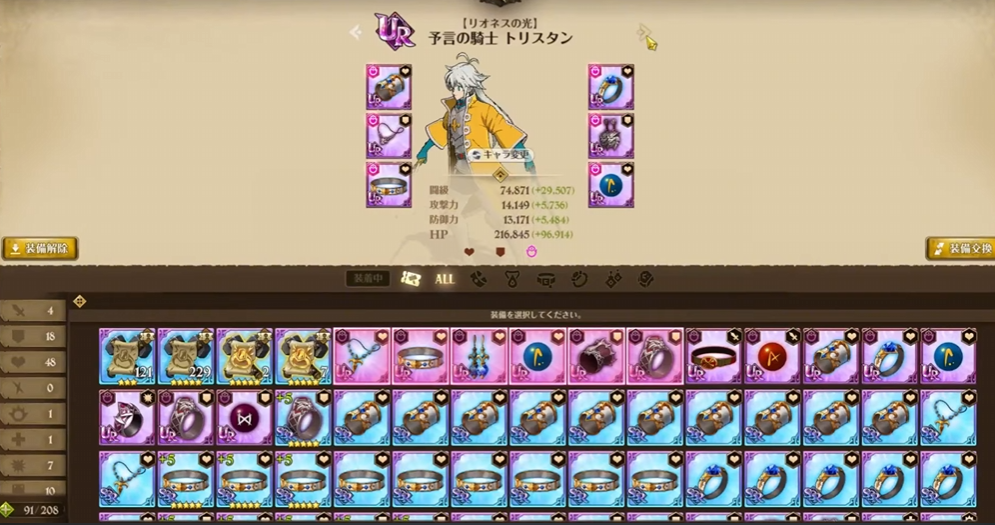
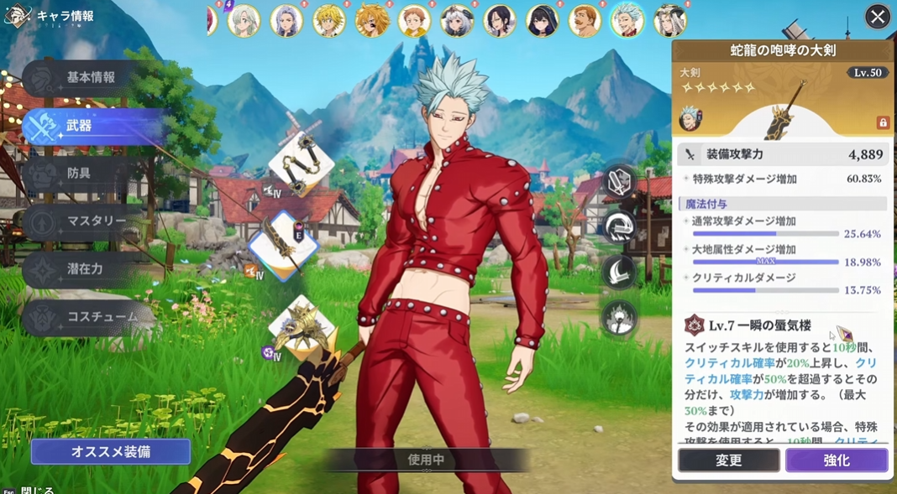
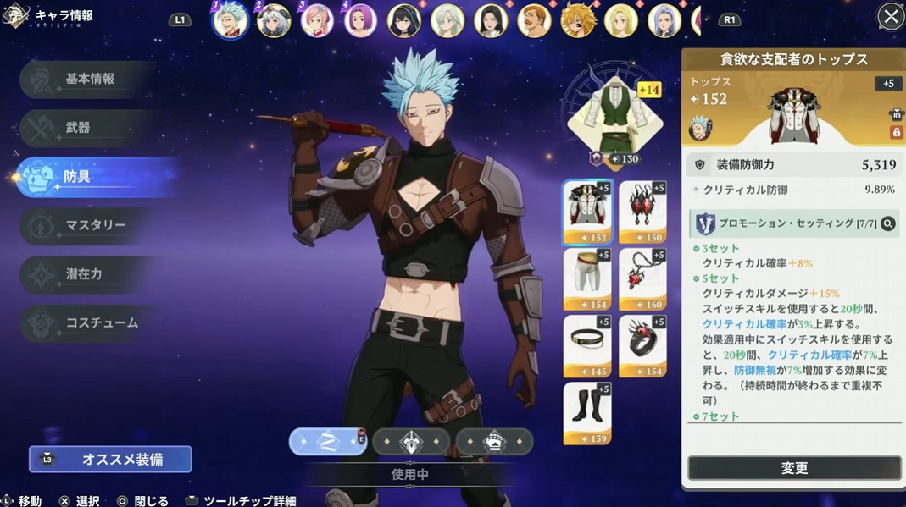

#데이터베이스 분석#   

**데이터베이스과제-22011018-정주환**   

**-무기 및 장비 시스템 구조 비교-**       
   
일곱 개의 대죄 그랜드크로스 : 영웅의 장비 슬롯과 무기 슬롯이 통합되어있음. 팔찌와 반지는 공격력을 관여하는 무기와 같으며, 목걸이와 귀걸이는 방어력, 벨트와 룬은 생명력을 관여함         
    

  
  
일곱 개의 대죄 오리진 : 영웅의 장비 슬롯과 무기 슬롯이 따로 분리되어있음. 한 영웅이 무기 슬롯을 최대 3개까지 장착할 수 있으며, 무기 3개의 공격력 총합이 영웅의 공격력을 관여함. 무기 3개는 서로 스위칭이 가능하기 때문에 자신이 원하는 전투 스타일을 정할 수 있음. 장비 슬롯은 총 7종이며 상의, 하의, 벨트, 신발, 목걸이, 귀걸이, 반지가 있음. 각각 상의 신발 귀걸이는 방어력, 하의 벨트 목걸이는 생명력, 반지는 공격력에 영향을 줌.